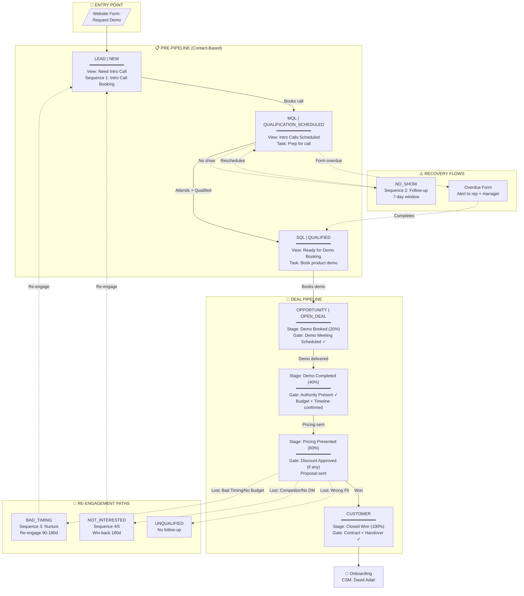
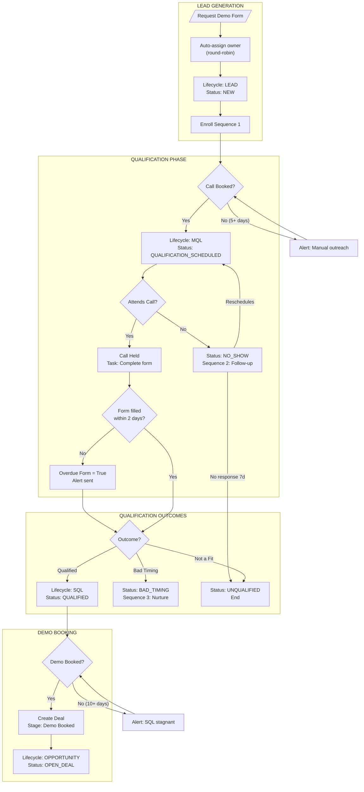
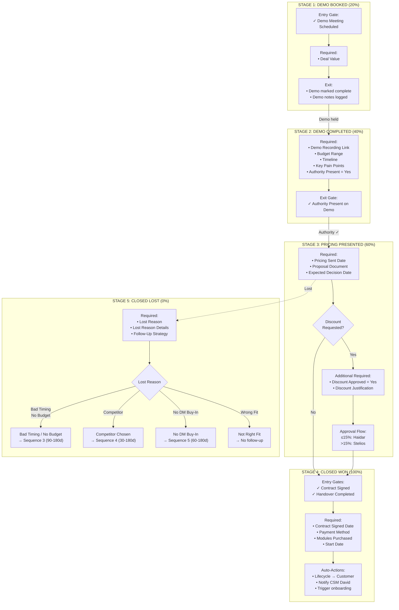
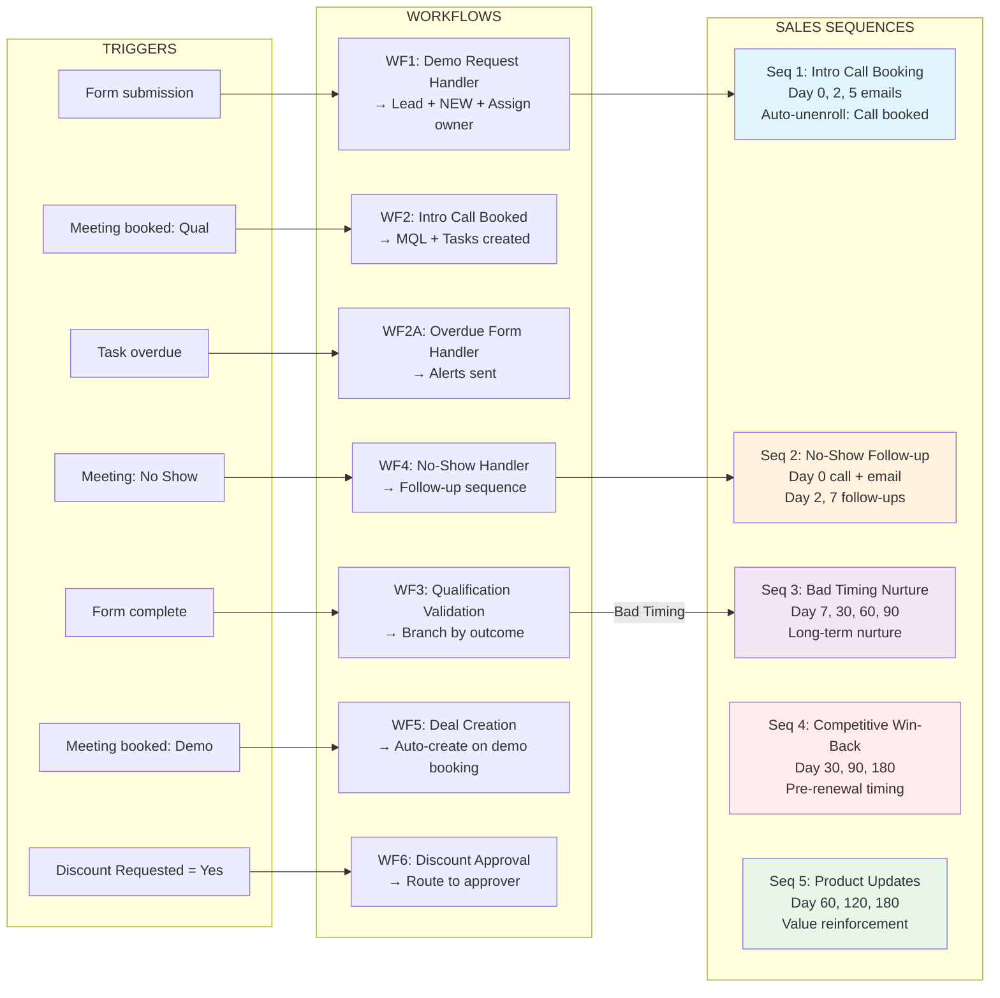
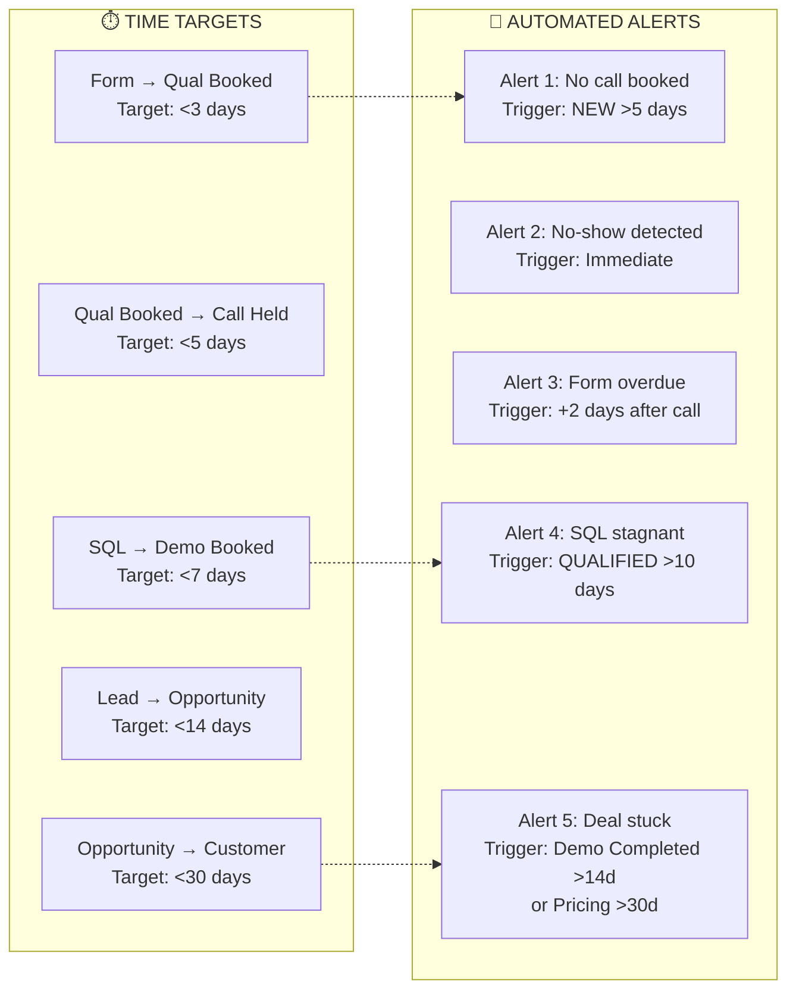
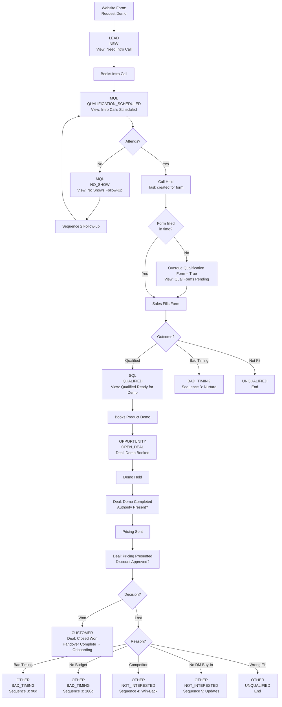

# HubSpot Sales Pipeline Master Plan - Consolidated

## Document Control

| Field | Value |
|-------|-------|
| **Version** | 1.1 |
| **Created** | 2026-02-03 |
| **Last Updated** | 2026-02-04 |
| **Status** | Implementation In Progress |
| **Primary Owner** | Matt Maxted (HubSpot/Marketing) |
| **Process Owner** | Haidar (Sales Manager) |
| **Executive Sponsor** | Stelios Ioannou |

**Source Documents Consolidated:**
- `Hubspot_masterplan_mm.md` (PRIMARY)
- `CONSOLIDATED_REQUIREMENTS_EXTRACTION.md`
- All supporting specification documents

---

## Table of Contents

1. [Overview & Objectives](#1-overview--objectives)
2. [Lifecycle Stage Configuration](#2-lifecycle-stage-configuration)
3. [Lead Status Property Setup](#3-lead-status-property-setup)
4. [Pre-Pipeline Contact Views](#4-pre-pipeline-contact-views)
4A. [Qualification Form Specification](#4a-qualification-form-specification)
5. [Deal Pipeline Configuration](#5-deal-pipeline-configuration)
6. [Required Properties](#6-required-properties)
7. [Stage Gating & Progression Controls](#7-stage-gating--progression-controls)
8. [Automated Workflows](#8-automated-workflows)
9. [Sales Sequences](#9-sales-sequences)
10. [Closed Lost Conditional Routing](#10-closed-lost-conditional-routing)
11. [Sales-to-Onboarding Handover](#11-sales-to-onboarding-handover)
12. [Permissions & Governance](#12-permissions--governance)
13. [Timestamp & Duration Tracking](#13-timestamp--duration-tracking)
14. [Dashboards & Reporting](#14-dashboards--reporting)
15. [Custom Reports](#15-custom-reports)
16. [Automated Alerts](#16-automated-alerts)
17. [Notification Rules](#17-notification-rules)
18. [Data Integrity & Cleanup](#18-data-integrity--cleanup)
19. [Success Metrics & KPIs](#19-success-metrics--kpis)
20. [Implementation Timeline](#20-implementation-timeline)
21. [Acceptance Testing Checklist](#21-acceptance-testing-checklist)
22. [Key Personnel](#22-key-personnel)
23. [Sales Rep Setup Requirements](#23-sales-rep-setup-requirements)

---

## 1. Overview & Objectives

### Purpose

This plan establishes a controlled sales process for StoneRise Technology where:
- Leads are managed through **contact views** until demo booking
- Transition to **deal-based management** with strict stage progression controls
- All email communications via **Sales Sequences** (not workflow emails) to avoid marketing contact consumption
- Full governance, tracking, and reporting throughout the funnel

### Design Principles

1. **Single Pipeline Architecture** - One "StoneRise Sales Pipeline" for all deals
2. **Contact-Level Qualification** - Qualification happens before deal creation
3. **Deal = Opportunity Only** - Deals created only when product demo is booked
4. **Sequences Over Workflows** - No workflow emails; all communications via sales sequences
5. **Governance First** - Stage gates, required fields, and approval workflows
6. **Module-Ready Design** - Properties support future multi-module expansion

### Architecture Decisions

| Decision | Approach | Rationale |
|----------|----------|-----------|
| Pipeline count | Single pipeline | Simplicity for initial launch; properties support future split |
| Email delivery | Sales Sequences only | Avoids marketing contact consumption |
| Enterprise deals | Deal Type property | Filter/report by type, not separate pipeline |
| Qualification | Contact-level properties | Contacts qualified before becoming deals |
| Stage gates | Required fields + validation workflows | Double enforcement for data integrity |

---

## 2. Lifecycle Stage Configuration

Configure HubSpot lifecycle stages to track contact progression:

### Stages

| Stage | Description | Trigger |
|-------|-------------|---------|
| **Subscriber** | Known contact, no buying intent | Newsletter signup, content download |
| **Lead** | Potential buyer, light interest | "Request a Demo" form submission |
| **MQL** | Marketing believes likely buyer | Intro call booked |
| **SQL** | Sales actively pursuing | Qualification passed |
| **Opportunity** | Demo booked, deal exists | Product demo scheduled |
| **Customer** | Closed won | Payment received |
| **Other** | Closed Lost / Do Not Contact | Deal lost or explicit opt-out |

### Automation Rules

```
Form "Request a Demo" submitted → Lead + auto-email with qualification meeting link
Qualification meeting booked → MQL
Qualification form completed (Qualified) → SQL
Product demo meeting booked → Opportunity (deal created)
Deal Closed Won → Customer
Deal Closed Lost → Other
```

**Note:** HubSpot automatically tracks time in each lifecycle stage via native properties (Date entered, Date exited, Latest time, Cumulative time).

---

## 3. Lead Status Property Setup

Create custom **Lead Status** property (single select dropdown) for sub-stage tracking:

### Values

| Status | Description | Active View |
|--------|-------------|-------------|
| **NEW** | Submitted demo request, not yet booked call | New Demo Requests |
| **ATTEMPTED_TO_CONTACT** | Rep has tried calling/emailing, no response yet | Attempted Contact - Follow Up |
| **IN_PROGRESS** | Active conversation happening, working towards booking | In Progress |
| **QUALIFICATION_SCHEDULED** | Intro call booked, awaiting call | Intro Calls Scheduled |
| **QUALIFIED** | Passed qualification, ready for demo | Qualified - Ready for Demo |
| **NO_SHOW** | Missed intro call | No Shows - Follow Up |
| **NO_RESPONSE** | Completed outreach sequence with no engagement | Periodic Follow-Up |
| **OPEN_DEAL** | Deal exists (auto-set) | (Managed in pipeline) |
| **BAD_TIMING** | Good fit but not right now | Bad Timing Follow-Ups |
| **NOT_INTERESTED** | Good fit, try again later | Re-Engagement Candidates |
| **UNQUALIFIED** | Not a fit | (No active view) |
| **DO_NOT_CONTACT** | Explicit opt-out | (No active view) |

### Field Settings

- **Required:** Yes (on contact record)
- **Editable by:** Sales team
- **Auto-update:** Via workflows where possible

---

## 4. Pre-Pipeline Contact Views

Create 7 filtered contact views for sales team:

### View 1: "Need Intro Call"

| Filter | Value |
|--------|-------|
| Lifecycle Stage | Lead |
| Lead Status | NEW, ATTEMPTED_TO_CONTACT, IN_PROGRESS |

**Purpose:** All leads awaiting intro call booking

---

### View 2: "Intro Calls Scheduled"

| Filter | Value |
|--------|-------|
| Lifecycle Stage | MQL |
| Lead Status | QUALIFICATION_SCHEDULED |

**Purpose:** Upcoming intro calls requiring prep

---

### View 3: "Qualification Forms Pending"

| Filter | Value |
|--------|-------|
| Overdue Qualification Form | True |

**Purpose:** Contacts who haven't completed qualification form after their call

---

### View 4: "Qualified - Ready for Demo Booking"

| Filter | Value |
|--------|-------|
| Lifecycle Stage | SQL |
| Lead Status | QUALIFIED |
| Associated Deal | None |

**Purpose:** Passed qualification, needs product demo booking

---

### View 5: "No Shows - Follow Up Required"

| Filter | Value |
|--------|-------|
| Lead Status | NO_SHOW |
| Intro Call Date | Last 7 days |

**Purpose:** Missed intro calls needing follow-up

---

### View 6: "Bad Timing Follow-Ups"

| Filter | Value |
|--------|-------|
| Lead Status | BAD_TIMING |
| Next Follow-Up Date | ≤ Today + 14 days |

**Purpose:** Re-engage timing-based losses

---

### View 7: "Re-Engagement Candidates"

| Filter | Value |
|--------|-------|
| Lead Status | NOT_INTERESTED |
| Re-Engagement Date | ≤ Today |

**Purpose:** Contacts ready to retry after X months

---

## 4A. Forms Summary

| Form Name | Type | Object | Purpose | Status |
|-----------|------|--------|---------|--------|
| **LP \| Procurement \| Demo Form** | Public | Contact | Website entry point - captures demo requests | ✅ Created |
| **Sales Qualification Form** | Internal | Contact | Post-intro call qualification capture (Procurement Problem Confirmed removed - not module-specific) | ✅ Created |
| **~~Demo Debrief Form~~** | Internal | Deal | Post-demo details (NOT USED - fields entered directly on deal) | ❌ Not needed |
| **~~Handover Form~~** | Internal | Deal | CSM handover (NOT USED - handover via 14 required deal properties) | ❌ Not needed |

---

## 4B. Qualification Form Specification

### Form Details

| Setting | Value |
|---------|-------|
| **Form Name** | Sales Qualification Form |
| **Form Type** | Internal/Non-public (sales team only) |
| **Associated Object** | Contact |
| **Purpose** | Capture qualification data after intro call, trigger SQL promotion workflow |
| **Status** | ✅ Created |

### Form Fields

#### Required Fields

| Field | Type | Options |
|-------|------|---------|
| Qualification Outcome | Dropdown | Qualified / Not a Fit / Bad Timing |
| Contact Role | Dropdown | Decision Maker / Influencer / Champion / End User |
| Company Size | Number | - |
| Primary Module Interest | Dropdown | Procurement / HR / Commercial / H&S / Site Management |
| Key Pain Points | Multi-checkbox | Manual processes / No visibility / Poor supplier mgmt / Compliance / Cost control / Other |
| Budget Indication | Dropdown | £0-500/mo / £500-1000/mo / £1000-2500/mo / £2500+/mo / Not Discussed |
| Timeline to Decision | Dropdown | <1 month / 1-3 months / 3-6 months / 6+ months / Exploring |
| **Deal Value Estimate** | Currency | - |
| Qualification Notes | Text area | - |

#### Optional Fields

| Field | Type | Options |
|-------|------|---------|
| Secondary Module Interest | Multi-checkbox | Procurement / HR / Commercial / H&S / Site Management |
| Current Software Used | Text | - |
| Decision Making Process | Text area | - |

### Form Submission Actions

1. Set "Qualification Form Completed" = True
2. Triggers Workflow 3: Qualification Form Validation & SQL Promotion
3. Lead Status updated based on Qualification Outcome:
   - Qualified → QUALIFIED
   - Not a Fit → UNQUALIFIED
   - Bad Timing → BAD_TIMING

### Access & Location

- **Visible to:** Sales team only
- **Linked from:** Contact record sidebar or CRM card
- **When to use:** After completing an intro call with a lead

---

## 5. Deal Pipeline Configuration

### Pipeline: "StoneRise Sales Pipeline"

### Deal Creation

Deals are created **automatically** via Workflow 5 when a Product Demo meeting is booked. This ensures:
- Data integrity is maintained (all required qualification data captured)
- Consistent deal naming: "[Company Name] - [Primary Module] - [Month/Year]"
- Proper association with contacts and companies
- Automatic lifecycle stage progression

**Important:** Manual deal creation should be avoided. All deals should flow through the qualification process to ensure proper data capture and reporting accuracy.

See [Section 8: Workflow 5](#workflow-5-auto-create-deal-on-product-demo-booking) for full automation details.

---

#### Stage 1: Demo Booked (20% probability)

**Entry Requirement:**
- Product demo meeting scheduled in HubSpot calendar

**Inherited Properties from Qualification:**
- Contact Role
- Company Size
- Current Software Used
- Primary Module Interest
- Key Pain Points
- Budget Indication
- Qualification Notes

**Required Properties:**
- Deal Value (Currency) - Estimated contract value for pipeline reporting and forecasting

**Exit Requirement:**
- Deal Value populated
- Demo meeting marked complete
- Demo notes logged

---

#### Stage 2: Demo Completed (40% probability)

**Entry Requirement:** Stage 1 exit requirements met

**Required Properties:**
- Demo Recording Link (URL)
- Demo Notes (text area)
- Confirmed Budget Range
- Confirmed Timeline
- Modules Demonstrated (multi-checkbox)
- Next Steps Agreed (text area)
- Authority Present on Demo (Yes/No) - **NEW - critical gate**

**Exit Requirement:**
- All properties complete
- Ready for Pricing = Yes
- Authority Present on Demo = Yes

---

#### Stage 3: Pricing Presented & Decision Pending (60% probability)

**Entry Requirement:** Stage 2 exit requirements met + Authority Present = Yes

**Required Properties:**
- Pricing Sent Date (auto-populated)
- Pricing Sent Method (dropdown)
- Decision Maker Email Confirmed (checkbox)
- Proposal Document Link
- Expected Decision Date
- Discount Requested (Yes/No) - **NEW**
- Discount Approved (Yes/No) - **NEW** (required if discount requested)
- Discount Justification (text) - **NEW** (required if discount requested)

**Exit Requirement:**
- Manual progression only
- Won/lost reason documented
- If discount requested: Discount Approved = Yes

---

#### Stage 4: Closed Won (100% probability)

**Entry Requirement:**
- Stage 3 exit requirements met
- Contract Signed = Yes
- Handover Completed = Yes - **NEW - critical gate**

**Required Properties:**
- Contract Signed Date (auto-populated)
- Payment Method
- Payment Received Date
- Contract Value (Annual)
- Modules Purchased (multi-select)
- Handover Completed (Yes/No) - **NEW**
- Start Date - **NEW**

**Exit Actions:**
1. Update Lifecycle Stage → Customer
2. Update Lead Status → OPEN_DEAL
3. Trigger onboarding workflow
4. Notify Customer Success Manager (David Adair)
5. Create tasks in customer success pipeline

---

#### Stage 5: Closed Lost (0% probability)

**Entry Requirement:** Manual progression from any stage

**Required Properties:**
- Lost Reason (dropdown)
- Lost Reason Details (text area)
- Competitor Name (conditional)
- Follow-Up Strategy (dropdown)

**Lost Reason Values:**
- Price too high
- Competitor chosen
- No budget
- Bad timing
- Not the right fit
- No decision maker buy-in
- Other

**Exit Actions:** See Section 10 (Closed Lost Conditional Routing)

---

## 6. Required Properties

### 6.1 Contact Properties (Qualification)

| Property | Type | Required | Purpose |
|----------|------|----------|---------|
| Qualification Form Completed | Checkbox | - | Triggers workflow |
| Intro Call Date | DateTime | - | Auto from meeting |
| Qualification Meeting Booked | Checkbox | - | Auto-populated |
| Overdue Qualification Form | Yes/No | No | Triggers View 3 when form not completed after call |
| Qualification Outcome | Dropdown | Yes | Qualified / Not a Fit / Bad Timing |
| Contact Role | Dropdown | Yes | Decision Maker / Influencer / Champion / End User |
| Company Size | Number | Yes | - |
| Current Software Used | Text | - | - |
| Primary Module Interest | Dropdown | Yes | Procurement / HR / Commercial / H&S / Site Management |
| Secondary Module Interest | Multi-checkbox | No | Procurement / HR / Commercial / H&S / Site Management |
| Key Pain Points | Multi-checkbox | Yes | Manual processes / No visibility / Poor supplier mgmt / Compliance / Cost control / Other |
| Budget Indication | Dropdown | Yes | £0-500/mo / £500-1000/mo / £1000-2500/mo / £2500+/mo / Not Discussed |
| Timeline to Decision | Dropdown | Yes | <1 month / 1-3 months / 3-6 months / 6+ months / Exploring |
| **Deal Value Estimate** | Currency | Yes | Estimated annual contract value - copied to Deal Amount when deal created |
| Decision Making Process | Text area | - | - |
| Qualification Notes | Text area | Yes | - |

---

### 6.2 Deal Properties

#### Demo Booked Fields

| Property | Type | Stage Required | Options |
|----------|------|----------------|---------|
| Amount (Deal Value) | Currency | Demo Booked | Copied from Contact "Deal Value Estimate" property via WF5 |

#### Budget & Timeline Fields

| Property | Type | Stage Required | Options |
|----------|------|----------------|---------|
| Budget Range | Dropdown | Demo Completed | £0-500/mo / £500-1000/mo / £1000-2500/mo / £2500+/mo / Not Discussed |
| Timeline to Decision | Dropdown | Demo Completed | <1 month / 1-3 months / 3-6 months / 6+ months / Exploring |
| Decision Making Process | Text | Demo Completed | - |
| Key Pain Points | Multi-checkbox | Demo Completed | Manual processes / No visibility / Poor supplier mgmt / Compliance / Cost control / Other |
| Demo Recording Link | URL | Demo Completed | - |
| **Authority Present on Demo** | Yes/No | Demo Completed | - |

#### Pricing Fields

| Property | Type | Stage Required | Options |
|----------|------|----------------|---------|
| Pricing Sent Date | Date | Pricing Presented | - |
| Pricing Sent Method | Dropdown | Pricing Presented | Email / Video Call / In-Person Meeting / Post |
| Decision Maker Email Confirmed | Checkbox | Pricing Presented | - |
| Proposal Document Link | File/URL | Pricing Presented | - |
| Expected Decision Date | Date | Pricing Presented | - |
| **Discount Requested** | Yes/No | Pricing Presented | - |
| **Discount Approved** | Yes/No | Pricing Presented (conditional) | - |
| **Discount Justification** | Text area | Pricing Presented (conditional) | - |

#### Closed Won Fields

| Property | Type | Stage Required | Options |
|----------|------|----------------|---------|
| Contract Signed Date | Date | Closed Won | - |
| Payment Method | Dropdown | Closed Won | Direct Debit / Bank Transfer / Credit Card |
| Payment Received Date | Date | Closed Won | - |
| Contract Value | Currency | Closed Won | - |
| Modules Purchased | Multi-checkbox | Closed Won | Procurement / HR / Commercial / H&S / Site Management |
| **Handover Completed** | Yes/No | Closed Won | - |
| **Start Date** | Date | Closed Won | - |
| **Handover Risks** | Text area | Closed Won | - |

#### Closed Lost Fields

| Property | Type | Stage Required | Options |
|----------|------|----------------|---------|
| Lost Reason | Dropdown | Closed Lost | Price too high / Competitor chosen / No budget / Bad timing / Not the right fit / No decision maker buy-in / Other |
| Lost Reason Details | Text area | Closed Lost | - |
| Competitor Name | Text | Closed Lost (conditional) | - |
| Follow-Up Strategy | Dropdown | Closed Lost | Re-engage in 3 months / Re-engage in 6 months / Re-engage in 12 months / No follow-up / Refer to partner |

#### Deal Health & Tracking

| Property | Type | Purpose |
|----------|------|---------|
| **Deal Type** | Dropdown | SME / Mid-Market / Enterprise |
| **Deal Health** | Dropdown | Healthy / At Risk / Stalled |

---

## 7. Stage Gating & Progression Controls

### Method: Property Logic (Native HubSpot) - IMPLEMENTED

**Path:** Settings → Objects → Deals → Pipelines → Edit property logic

Using HubSpot's native property logic feature to enforce required fields per stage. When a rep attempts to move a deal to a gated stage, HubSpot presents a modal requiring them to fill in missing fields before the move completes.

**Status:** ✅ All gates implemented using property logic

#### Gate 1: Demo Booked Entry

**Method:** Automatic via Workflow 5 (deal created directly in Demo Booked when Product Demo is scheduled)

**No manual gate needed** - deals are born into this stage, not moved there.

---

#### Gate 2: Demo Completed

**Controlling Property:** Deal Stage = Demo Completed

**Required Properties (7):**
- Demo Recording Link
- Demo Notes
- Confirmed Budget Range
- Confirmed Timeline
- Modules Demonstrated
- Next Steps Agreed
- Authority Present on Demo = Yes

**Effect:** Rep cannot move deal to Demo Completed without filling these fields. Modal prompts for missing fields.

---

#### Gate 3: Pricing Presented

**Controlling Property:** Deal Stage = Pricing Presented

**Required Properties (5):**
- Pricing Sent Date
- Pricing Sent Method
- Decision Maker Email Confirmed
- Proposal Document Link
- Expected Decision Date

**Effect:** Rep cannot move deal to Pricing Presented without filling these fields.

---

#### Gate 4: Closed Won

**Controlling Property:** Deal Stage = Closed Won

**Required Properties (6):**
- Contract Signed Date
- Payment Method
- Contract Value
- Modules Purchased
- Start Date
- Handover Completed = Yes

**Effect:** Rep cannot move deal to Closed Won without filling these fields and confirming handover.

---

#### Gate 5: Closed Lost

**Controlling Property:** Deal Stage = Closed Lost

**Required Properties (3):**
- Lost Reason
- Lost Reason Details
- Follow-Up Strategy

**Effect:** Rep cannot mark deal as lost without documenting reason and next steps.

---

## 8. Automated Workflows

### Workflow 1: Auto-Response on Demo Request

**Trigger:** Form submission: "Request a Demo"

**Actions:**
1. Update contact properties:
   - Lifecycle Stage → Lead
   - Lead Status → NEW
   - Contact Owner → Round-robin to sales team
   - `date_entered_new` → Current datetime
2. Enroll in **Sequence 1: Intro Call Booking** (NOT workflow email)

**Note:** Task creation and Haidar notification removed - Sequence 1 handles follow-up automatically.

---

### Workflow 1B: Sequence 1 No Response Handler

**Trigger:** Contact completed Sequence 1 (Intro Call Booking)

**Actions:**
1. Check if Lead Status = NEW (hasn't progressed)
   - IF yes → Set Lead Status → NO_RESPONSE
   - IF no → End (contact already booked or progressed)

**Purpose:** Auto-marks contacts as cold when they complete the full sequence without booking an intro call.

---

### Workflow 2: Intro Call Booked

**Trigger:** Meeting booked with type = "Intro Call"

**Note:** Meeting is called "Intro Call" on all public-facing materials.

**Actions:**
1. Update contact properties:
   - Lifecycle Stage → MQL
   - Lead Status → QUALIFICATION_SCHEDULED
   - Intro Call Date → Meeting datetime
   - Qualification Meeting Booked → True
   - `date_entered_qual_scheduled` → Current datetime
2. Calculate: `days_new_to_qual_scheduled`
3. Unenroll from Sequence 1
4. Mark "New demo request" task complete
5. Create new task: "Prep for intro call: [Contact Name]"
   - Due: 1 day before call
6. Create new task: "Complete qualification form: [Contact Name]"
   - Due: Meeting start time + 2 hours
   - Description: "Fill qualification form after call completion"

---

### Workflow 2A: Qualification Form Overdue Handler

**Trigger:** Task "Complete qualification form" is overdue

**Actions:**
1. Update contact properties:
   - Overdue Qualification Form → True
2. Send internal notification email to contact owner (sales rep)
3. Send internal notification email to Sales Manager (Haidar)

---

### Workflow 3: Qualification Form Validation & SQL Promotion

**Trigger:** "Qualification Form Completed" = True

**Branch A: QUALIFIED**
- IF Qualification Outcome = "Qualified" AND all required fields complete
- THEN:
  - Lifecycle Stage → SQL
  - Lead Status → QUALIFIED
  - Overdue Qualification Form → False
  - `date_entered_qualified` → Current datetime
  - Calculate duration fields
  - Create task: "Book product demo with [Contact Name]" (Due: 2 days)

**Branch B: UNQUALIFIED**
- IF Qualification Outcome = "Not a Fit"
- THEN:
  - Lead Status → UNQUALIFIED
  - Overdue Qualification Form → False
  - No follow-up actions

**Branch C: BAD TIMING**
- IF Qualification Outcome = "Bad Timing"
- THEN:
  - Lead Status → BAD_TIMING
  - Overdue Qualification Form → False
  - **Note:** WF3B will auto-create follow-up tasks at 30 and 90 days

---

### Workflow 3B: Bad Timing Follow-Up

**Trigger:** Lead Status changed to BAD_TIMING

**Actions:**
1. Delay: 30 days
2. Check if Lead Status = BAD_TIMING
   - IF no → End workflow
   - IF yes → Create task: "30-day check-in: [Contact Name] - Bad Timing"
3. Delay: 60 days (90 days total)
4. Check if Lead Status = BAD_TIMING
   - IF no → End workflow
   - IF yes → Create task: "90-day re-engage: [Contact Name] - Bad Timing"

**Purpose:** Creates timed follow-up tasks for Bad Timing contacts. Checks status before each task to avoid creating tasks if contact has progressed.

---

### Workflow 3C: SQL Stagnant Alert

**Trigger:** Lead Status changed to QUALIFIED

**Actions:**
1. Delay: 5 days
2. Check if Lead Status = QUALIFIED
   - IF no → End (contact has progressed to demo or other status)
   - IF yes → Continue
3. Create task:
   - Title: "OVERDUE: Book demo for [Contact Name]"
   - Assigned to: Contact owner
   - Priority: High
   - Due: Today
4. Send internal notification:
   - To: Contact owner + Haidar
   - Subject: "SQL stagnant: [Company Name] - 5 days without demo booking"
5. Delay: 5 days (10 days total from QUALIFIED)
6. Check if Lead Status = QUALIFIED
   - IF no → End
   - IF yes → Continue
7. Send internal notification:
   - To: Contact owner + Haidar
   - Subject: "URGENT: SQL stagnant 10+ days - [Company Name]"

**Purpose:** Monitors SQLs to ensure demo bookings happen. Escalates at 5 and 10 days if still qualified without a demo booked.

---

### Workflow 4: Intro Call No-Show Handler

**Trigger:** Meeting type = "Intro Call" AND Outcome = "No Show"

**Actions:**
1. Update Lead Status → NO_SHOW
2. Enroll in **Sequence 2: No-Show Follow-Up** (NOT workflow email)

**Note:** WF4B handles auto-updating to NOT_INTERESTED when Sequence 2 completes without response.

---

### Workflow 4B: Sequence 2 No Response Handler

**Trigger:** Contact completed Sequence 2 (No-Show Follow-Up)

**Actions:**
1. Check if Lead Status = NO_SHOW (hasn't rescheduled)
   - IF yes → Set Lead Status → NOT_INTERESTED
   - IF no → End (contact already rescheduled or progressed)

**Purpose:** Auto-marks no-show contacts as NOT_INTERESTED when they complete Sequence 2 without rescheduling.

---

### Workflow 5: Auto-Create Deal on Product Demo Booking

**Trigger:** Meeting booked with type = "Product Demo"

**Actions:**
1. Check if contact has open deal (not Closed Won/Lost)
   - IF yes → Send notification to rep (possible duplicate) AND continue
   - IF no → Continue
   - **Note:** Contacts may have multiple deals for different products, so we flag but don't block
2. Verify contact is SQL lifecycle stage
   - IF not SQL → Alert to sales manager (data integrity issue) → End workflow
   - IF SQL → Continue
3. Create new deal:
   - Name: "[Company Name] - [Primary Module] - [Month/Year]"
   - Pipeline: StoneRise Sales Pipeline
   - Stage: Demo Booked
   - Owner: Contact owner (inherited)
   - Associated contacts: Primary + meeting attendees
   - Close date: +30 days from demo
   - Amount: Copy from contact Deal Value Estimate
   - Copy from contact: Primary Module Interest, Contact Role, Company Size, Key Pain Points, Budget Indication, Qualification Notes, Secondary Module Interest
4. Update contact:
   - Lifecycle Stage → Opportunity
   - Lead Status → OPEN_DEAL
5. Create task: "Prepare product demo for [Contact Name]" (Due: 1 day before meeting)
   - Assigned to: Deal owner
   - Includes: Module interest, key pain points, budget context from qualification

---

### Workflow 6: Closed Lost Follow-Up

**Trigger:** Deal Stage changed to Closed Lost

**Actions:**
Branch by Follow-Up Strategy property:

**Branch 1: Re-engage in 3 months**
- Delay: 90 days
- Create task: "Re-engage closed lost: [Deal Name]" with lost reason context

**Branch 2: Re-engage in 6 months**
- Delay: 180 days
- Create task: "Re-engage closed lost: [Deal Name]" with lost reason context

**Branch 3: Re-engage in 12 months**
- Delay: 365 days
- Create task: "Re-engage closed lost: [Deal Name]" with lost reason context

**Branch 4: No follow-up**
- End (no action)

**Branch 5: Refer to partner**
- Create immediate task: "Refer to partner: [Deal Name]"

**Purpose:** Creates timed follow-up tasks based on the rep's selected follow-up strategy for closed lost deals.

---

### Workflow 7: Demo Completed - Task Reminder

**Trigger:** Meeting outcome = Completed (Product Demo meeting)

**Actions:**
1. Check if Deal Stage = Demo Booked
   - IF no → End (deal already progressed)
   - IF yes → Continue
2. Create task:
   - Title: "Complete demo details and progress deal: [Deal Name]"
   - Due: Today
   - Notes: List all required fields (Demo Recording Link, Demo Notes, Budget, Timeline, Modules, Next Steps, Authority Present)

**Purpose:** Prompts rep to fill in required demo fields. Property logic gate enforces completion before allowing progression to Demo Completed stage.

---

### Workflow 7B: Demo Completed - Pricing Task

**Trigger:** Deal Stage changed to Demo Completed

**Actions:**
1. Create task:
   - Title: "Prepare and send pricing: [Deal Name]"
   - Assigned to: Deal owner
   - Due: 2 days from now
   - Notes: Prepare pricing proposal based on modules demonstrated, create proposal document, send to decision maker, fill pricing fields, progress to Pricing Presented

**Purpose:** Prompts rep to prepare and send pricing after demo is complete.

---

### Workflow 8: Discount Approval Routing

**Trigger:** Discount Requested = Yes

**Re-enrollment:** On (allows multiple discount requests per deal)

**Actions:**

**Branch by discount size:**

**Branch 1: Discount ≤15% (Haidar approval)**
1. Set Discount Approved → Pending
2. Create approval task for Haidar:
   - Title: "Discount approval needed: [Deal Name]"
   - Include: Discount %, justification, deal value
   - Due: Today
3. Send internal notification to Haidar

**Branch 2: Discount >15% (Stelios approval)**
1. Set Discount Approved → Pending
2. Create approval task for Haidar (to review)
3. Create approval task for Stelios (to approve):
   - Title: "Large discount approval: [Deal Name] ([Discount %]%)"
   - Priority: Highest
4. Send internal notification to Haidar + Stelios

**Purpose:** Routes discount requests to appropriate approver. Re-enrollment allows revised requests if initial discount is rejected.

---

### Workflow 8B: Discount Approval Notification

**Trigger:** Discount Approved changed to Yes or No

**Actions:**

**Branch A: Approved (Discount Approved = Yes)**
- Send notification to deal owner: "Discount approved"

**Branch B: Rejected (Discount Approved = No)**
- Send notification to deal owner: "Discount rejected"
- Create task for deal owner: "Discount rejected - Review pricing"
- Clear Discount Requested → No (resets for new request)

**Purpose:** Notifies rep of approval decision. Auto-resets on rejection to allow new discount requests.

---

### Workflow 9: Closed Won Auto-Actions

**Trigger:** Deal Stage changed to Closed Won

**Actions:**
1. Update associated contact:
   - Lifecycle Stage → Customer
2. Send internal notification to David Adair (CSM):
   - Subject: "New customer onboarding: [Deal Name]"
   - Include: Deal details, modules purchased, start date, handover information
   - Body includes: Decision maker, operational owner, reason for purchase, success signals

**Purpose:** Triggers customer handoff to CSM when deal closes. All handover details captured via required deal properties before close.

---

### Workflow 10: Pricing Presented - Follow Up & Escalation

**Trigger:** Deal Stage changed to Pricing Presented

**Actions:**
1. Create task:
   - Title: "Follow up on decision: [Deal Name]"
   - Due: Expected Decision Date
   - Assigned to: Deal owner
2. Delay: 5 business days
3. Check if Deal Stage = Pricing Presented
   - IF no → End (deal closed/progressed)
   - IF yes → Create task: "OVERDUE: Chase decision - [Deal Name]" (deal owner)
4. Delay: 5 business days (10 total)
5. Check if Deal Stage = Pricing Presented
   - IF no → End
   - IF yes → Send notification to Haidar: "URGENT: Deal stalled 10+ days"

**Purpose:** Ensures pricing decisions don't stall. Escalates to manager at 10 business days.

---

## 9. Sales Sequences

**CRITICAL:** All email communications via Sales Sequences, NOT workflow emails, to avoid marketing contact consumption.

**IMPORTANT - Sequence Enrollment & Meeting Links:**
- HubSpot requires **Sales Hub Enterprise** to enroll contacts in sequences via workflows
- Current tier: **Sales Hub Professional**
- **Workaround implemented:** Workflows create tasks prompting reps to manually enroll contacts in sequences
- **Meeting links in sequences:** Use "Sender's meetings link" to dynamically insert contact owner's personal meeting scheduler
- **Requirement:** Each sales rep must set their Intro Call (30 min) as their default meeting link
- Product Demo bookings are handled manually by reps (not via sequences)

### Sequence 1: Intro Call Booking

**Enrollment:** Workflow 1 (demo request form submission)
**Purpose:** Encourage contact to self-book intro call
**Auto-unenroll:** When intro call is booked or contact replies

| Step | Day | Type | Template Name | Content |
|------|-----|------|---------------|---------|
| 1 | 0 | Email | S1-01 Initial Interest | "Thanks for your interest in StoneRise - Let's talk" - Value prop + sender's meeting link (30 min default) |
| 2 | 3 | Email | S1-02 Three Day Follow Up | "Quick question about [Company]'s operations" - Social proof + sender's meeting link |
| 3 | 6 | Task | S1-03 Call Task | Call contact - no booking yet |
| 4 | 7 | Email | S1-04 Final Follow Up | Subject: "Shall I cease contact?" - Direct final outreach + sender's meeting link |

**Meeting Link Strategy:** All emails use "Sender's meetings link" which dynamically inserts the contact owner's default meeting scheduler.

**On sequence completion (no response):** WF1B auto-updates Lead Status → NO_RESPONSE

---

### Sequence 2: No-Show Follow-Up

**Enrollment:** Workflow 4 (intro call no-show)
**Purpose:** Re-engage no-shows to reschedule
**Auto-unenroll:** When meeting rescheduled or contact replies

| Step | Day | Type | Template Name | Content |
|------|-----|------|---------------|---------|
| 1 | 0 | Email | S2-01 Missed You | "We missed you - let's reschedule" + sender's meeting link |
| 2 | 2 | Email | S2-02 Still Interested | "Still interested in improving [Company]'s operations?" + sender's meeting link |
| 3 | 3 | Task | S2-03 Call Task | Call no-show contact - final outreach attempt |

**Meeting Link Strategy:** Uses "Sender's meetings link" (contact owner's default Intro Call scheduler).

**On sequence completion (no response):** WF4B auto-updates Lead Status → NOT_INTERESTED

---

### ~~Sequence 3: Bad Timing Nurture~~ → Replaced by Workflow 3B

**Note:** Sequence 3 replaced with task-based Workflow 3B (no templated email content available at this stage).

See **Workflow 3B: Bad Timing Follow-Up** in Section 8 for details.

---

### Sequence 4: Competitive Win-Back

**Enrollment:** Closed Lost workflow (lost reason = Competitor Chosen)
**Purpose:** Win back contacts who chose competitor
**Auto-unenroll:** When task complete or contact responds

| Step | Day | Type | Content |
|------|-----|------|---------|
| 1 | 30 | Email | "How's [Competitor] working out?" - No hard feelings + differentiator |
| 2 | 90 | Email | "New in StoneRise: [Feature]" - Address competitive gap |
| 3 | 180 | Email | "[Company] - Contract renewal coming up?" - Comparison offer |
| 4 | 180 | Task | "Competitive win-back: [Contact]" - Pre-renewal outreach |

---

### Sequence 5: Product Update Engagement

**Enrollment:** Closed Lost workflow (lost reason = No Budget / No Decision Maker Buy-In)
**Purpose:** Re-engage with product value over time
**Auto-unenroll:** When task complete or contact responds

| Step | Day | Type | Content |
|------|-----|------|---------|
| 1 | 60 | Email | "What's new at StoneRise" - Product updates + ROI content |
| 2 | 120 | Email | "[Industry Trend] - How StoneRise helps" - Thought leadership |
| 3 | 180 | Task | "Re-engage: [Contact] - Budget/approval cycle" |

---

## 10. Closed Lost Conditional Routing

### Workflow: Closed Lost - Conditional Actions

**Trigger:** Deal stage = Closed Lost

#### Branch 1: Bad Timing
- Lead Status → BAD_TIMING
- Create task: "Re-engage [Company] - Previously bad timing" (Due: +90 days)
- Enroll in Sequence 3: Bad Timing Nurture

#### Branch 2: No Budget
- Lead Status → BAD_TIMING
- Create task: "Re-engage [Company] - Budget availability check" (Due: +180 days)
- Enroll in Sequence 3: Bad Timing Nurture

#### Branch 3: Competitor Chosen
- Lead Status → NOT_INTERESTED
- Create task: "Competitive win-back: [Company] chose [Competitor]" (Due: +180 days)
- Enroll in Sequence 4: Competitive Win-Back
- Add to "Competitive Intelligence" list

#### Branch 4: No Decision Maker Buy-In
- Lead Status → NOT_INTERESTED
- Create task: "Re-approach [Company] with executive outreach" (Due: +180 days)
- Enroll in Sequence 5: Product Update Engagement

#### Branch 5: Not the Right Fit
- Lead Status → UNQUALIFIED
- No follow-up task
- Unenroll from all sequences
- No further automation

#### Branch 6: Do Not Contact
- Lead Status → DO_NOT_CONTACT
- Unenroll from ALL emails immediately
- Add to suppression list
- No follow-up tasks

---

## 11. Sales-to-Onboarding Handover

### Handover Template Requirements

Before marking Handover Completed = Yes, sales rep must document:

#### 1. Commercial & Decision Context
- Decision-maker name and role
- Operational owner (day-to-day user)
- Reason for purchase (business driver)

#### 2. Scope Agreed
- Users/pricing tier confirmed
- Teams or departments included
- Explicit exclusions

#### 3. Procurement Snapshot
- Current order method (email, spreadsheet, verbal, etc.)
- Main pain point (manual, no visibility, errors, compliance)

#### 4. Accounts Context
- Current accounting system
- Invoice approval process
- Finance team expectations

#### 5. Phase 1 Success Metrics
- Signal 1: What indicates value in first 30 days
- Signal 2: What indicates adoption success

#### 6. Commercial Guardrails
- Pricing tier and commitments
- Support level included
- Contract terms and renewal date

#### 7. Risk Flags
- Internal resistance or skepticism
- Unclear ownership or accountability
- Other implementation risks

#### OUT OF SCOPE (Discovery Tasks for Onboarding Team)
- Detailed workflows
- Supplier setup
- Approval chains
- Invoice matching rules
- User permissions

### Handover Workflow

**Trigger:** Handover Completed = Yes AND Deal Stage = Closed Won

**Actions:**
1. Notify Customer Success Manager (David Adair)
2. Create onboarding tasks in customer success pipeline
3. Update contact record with onboarding status
4. Schedule kickoff meeting

---

## 12. Permissions & Governance

### Pipeline Access Controls

| Role | Access Level |
|------|--------------|
| Sales Reps | View/edit own deals + team deals |
| Sales Manager (Haidar) | Full visibility, edit all deals, approve discounts ≤15% |
| Leadership (Stelios) | Full visibility, approve discounts >15% |
| Marketing (Matt) | Read-only pipeline, full contact access |
| Customer Success (David) | Read-only deals, edit customer records |

### Stage Progression Controls

- Enable "Deal stage must progress sequentially" in pipeline settings
- Only Sales Manager can move deals backwards (exception handling)
- Required field enforcement + validation workflows as secondary layer

### Discount Governance

| Discount Level | Approval Required | Approver |
|----------------|-------------------|----------|
| 0% (standard pricing) | None | - |
| 1-15% | Sales Manager | Haidar |
| >15% | Leadership | Stelios |

All discounts require written justification in `Discount Justification` field.

### Deal Health Tracking

| Status | Definition | Alert Trigger |
|--------|------------|---------------|
| Healthy | On track, regular activity, clear next steps | - |
| At Risk | Stalled >7 days, lack of authority, unclear decision | Weekly manager review |
| Stalled | No activity >14 days, ghosted contact | Immediate escalation |

---

## 13. Timestamp & Duration Tracking

### Native HubSpot Properties (Automatic)

HubSpot automatically tracks for each lifecycle stage:
- Date entered stage
- Date exited stage
- Latest time in stage (seconds)
- Cumulative time in stage (seconds)

**No setup required** - these populate automatically.

### Custom Lead Status Timestamps (Workflow-Populated)

| Property | Populated When |
|----------|----------------|
| `date_entered_new` | Lead Status = NEW |
| `date_entered_qual_scheduled` | Lead Status = QUALIFICATION_SCHEDULED |
| `date_entered_qualified` | Lead Status = QUALIFIED |
| `date_entered_no_show` | Lead Status = NO_SHOW |
| `date_entered_no_response` | Lead Status = NO_RESPONSE |

**Note:** `date_entered_open_deal` removed from contact - use Deal's native Create Date instead (supports multiple deals per contact).

### Custom Duration Calculations

| Property | Calculation |
|----------|-------------|
| `days_new_to_qual_scheduled` | `date_entered_qual_scheduled` - `date_entered_new` |
| `days_qual_scheduled_to_qualified` | `date_entered_qualified` - `date_entered_qual_scheduled` |
| `days_qualified_to_opportunity` | Deal Create Date - Contact `date_entered_qualified` (calculated in reporting) |

---

## 14. Dashboards & Reporting

### Dashboard 1: Pre-Pipeline Funnel Analysis ✅ BUILT

**Purpose:** Identify where contacts drop off before becoming opportunities

**Status:** ✅ Built with 6 widgets

**Widgets:**
1. Funnel Conversion Rates (Lead → MQL → SQL → Opportunity) ✅
2. ~~Average Time in Each Stage~~ - SKIPPED (funnel report shows this data when clicked)
3. Fall-Off Point Identification (table with % drop-off) ✅
4. Lead Status Distribution Over Time (stacked area) ✅
5. Intro Call Booking Rate (target: >60% within 7 days) ✅
6. No-Show Rate (target: <20%) ✅
7. Qualification Pass Rate by Rep ✅
8. Aging Analysis (contacts stuck >X days) ✅

---

### Dashboard 2: Deal Pipeline Health + Governance ✅ BUILT

**Purpose:** Monitor pipeline health and governance compliance

**Status:** ✅ Built with 9 widgets

**Pipeline Health Widgets:**
1. Deal Stage Funnel (with conversion rates) ✅
2. Average Days in Each Deal Stage ✅
3. ~~Pipeline Velocity Trend~~ - SKIPPED (complex calculation, use funnel time data instead)
4. Deal Stage Distribution (count + value) ✅
5. Win/Loss Rate by Month ✅

**Governance Widgets (NEW):**
6. Deals Without Authority Confirmed ✅
7. Deals with Discounts Pending Approval ✅
8. Deals Won Without Handover Completed ✅
9. Deal Health Distribution (Healthy/At Risk/Stalled) ✅
10. Deals at Risk (Pricing >30 days, Demo Completed >14 days) ✅

---

### Dashboard 3: Sales Manager Overview

**Layout Order:** Governance metrics BEFORE activity metrics

**Governance Section:**
1. Complete Funnel Metrics (single number cards)
2. Pipeline Forecast (probability-weighted)
3. Bottleneck Identification (alerts)
4. Discount & Handover Compliance
5. Undefined Decision Timeline Deals

**Activity Section (For Trend Analysis Only - NOT Rep Ranking):**
6. Intro calls held by rep
7. Product demos delivered by rep
8. Proposals sent
9. Module Interest Heatmap

**Time-to-Value Benchmarks:**
10. Form → Qual booked: Target <3 days
11. Qual booked → Call held: Target <5 days
12. SQL → Demo booked: Target <7 days
13. Lead → Opportunity: Target <14 days
14. Opportunity → Customer: Target <30 days

---

### Dashboard 4: Lead Source & Attribution Analysis

**Widgets:**
1. Lead Source Funnel Performance (table)
2. Average Conversion Time by Source
3. Cost per SQL / Cost per Customer (if ad spend tracked)

---

### Dashboard 5: Enterprise Pipeline (Leadership View) - NEW

**Purpose:** Consolidated view of large, complex opportunities
**Filter:** Deal Type = Enterprise AND Stage ≠ Closed Lost

**Widgets:**
1. Enterprise Pipeline by Company (table)
2. Enterprise Pipeline Value by Module (bar/pie)
3. Enterprise Deals by Stage (funnel)
4. Risk Reports: Deals without authority, At Risk/Stalled, Undefined timeline
5. Commercial Exposure: Deals with discounts, Discounted ACV
6. Win/Loss Analysis (quarterly)

**Excludes:** Calls, emails, meetings, SDR activity metrics

**Review Cadence:**
- Weekly: Leadership review
- Monthly: Risk assessment
- Quarterly: Win/loss analysis

---

## 15. Custom Reports

### Report 1: Stage Drop-Off Detail

**Filters:**
- Date range selector
- Lifecycle stage = Lead, MQL, or SQL
- Group by: Lead Status

**Columns:** Contact name, Company, Lead Status, Date entered, Days in status, Last activity, Owner, Source

**Purpose:** Identify stuck contacts and diagnose why

---

### Report 2: Intro Call Conversion Analysis

**Filters:**
- Date became MQL = Last 90 days
**Group by:** Owner

**Columns:** Contact, Company, Call booked date, Call held date, Outcome, Days booked→held, No-show?, Owner

**Purpose:** Track rep performance on intro calls

---

### Report 3: SQL → Opportunity Conversion Tracking

**Filters:**
- Date became SQL = Last 90 days
- Lifecycle stage = SQL or Opportunity

**Columns:** Contact, Company, Date became SQL, Date became Opportunity, Days as SQL, Has deal?, Owner

**Purpose:** Track how long SQLs take to book demos

---

### Report 4: Complete Journey Timeline

**Filters:**
- Date became Lead = Last 90 days

**Columns:** Contact, Company, Date Lead, Date MQL, Date SQL, Date Opportunity, Date Customer, Total journey days, Current stage, Owner

**Purpose:** End-to-end visibility of contact progression

---

## 16. Automated Alerts

### Alert 1: Intro Call Not Booked
- **Trigger:** Lead Status = NEW for >5 days
- **Action:** Alert to contact owner + high-priority task
- **Message:** "Contact has not booked intro call after 5 days - manual outreach needed"

### Alert 2: Intro Call No-Show
- **Trigger:** Lead Status changes to NO_SHOW
- **Action:** Immediate notification to rep + manager
- **Message:** "No-show detected. Auto follow-up sent, needs manual outreach."

### Alert 3: Qualification Form Not Completed
- **Trigger:** Overdue Qualification Form = True for >2 days
- **Action:** Escalation reminder to sales rep + manager
- **Message:** "Qualification form still pending for [Contact] - call was X days ago"
- **Note:** Initial alert sent via Workflow 2A when task becomes overdue; this is a secondary escalation

### Alert 4: SQL Stagnant - No Demo Booked
- **Trigger:** Lead Status = QUALIFIED for >10 days
- **Action:** Alert to rep + manager
- **Message:** "SQL qualified 10+ days without demo booking - review and action"

### Alert 5: Deal Stage Stagnation
- **Trigger:** Deal in "Demo Completed" >14 days OR "Pricing Presented" >30 days
- **Action:** Alert to rep + manager
- **Message:** "Deal at risk - stuck in [stage] for X days"

---

## 17. Notification Rules

### For Sales Reps

| Event | Notification Type |
|-------|-------------------|
| New lead assigned | Email + in-app |
| Intro call scheduled | Email 24hrs before |
| Product demo scheduled | Email 24hrs before |
| Qualification form not completed (2 days) | Reminder task |
| SQL not progressed (10 days) | Alert task |
| Deal stuck in stage (14+ days) | Task created |
| Follow-up task due | Email morning of |

### For Sales Manager (Haidar)

| Event | Notification Type |
|-------|-------------------|
| New demo request | Daily digest (9am) |
| Intro call no-show | Immediate alert |
| SQL stagnant >10 days | Daily digest |
| Deal at risk | Weekly digest |
| Deal Closed Won | Immediate |
| Deal Closed Lost | Immediate with reason |
| Discount approval needed | Immediate |
| Weekly funnel summary | Monday 9am |
| Monthly report | 1st of month 9am |

### For Customer Success (David Adair)

| Event | Notification Type |
|-------|-------------------|
| Deal Closed Won | Immediate |
| Handover completed | Onboarding workflow triggered |

### For Leadership (Stelios)

| Event | Notification Type |
|-------|-------------------|
| Monthly performance summary | 1st of month 10am |
| Major deal milestone (>£5k MRR) | Immediate |
| Discount approval >15% | Immediate |

---

## 18. Data Integrity & Cleanup

### Duplicate Prevention

Enable automatic detection on:
- Email address (contacts)
- Company domain (companies)
- Company name + contact email (deals)

### Data Validation Rules

- Email format validation on forms
- Phone number formatting (UK format)
- Required field enforcement on contact creation

### Regular Cleanup Tasks

| Frequency | Task |
|-----------|------|
| Weekly | Review NEW status >7 days - manual outreach or mark not interested |
| Weekly | Review NO_SHOW status - ensure follow-up actions taken |
| Monthly | Review SQL >30 days with no demo - reassess or mark bad timing |
| Quarterly | Review BAD_TIMING contacts - update status |
| Quarterly | Audit timestamp properties for accuracy |

---

## 19. Success Metrics & KPIs

### Pre-Pipeline Metrics

| Metric | Target |
|--------|--------|
| Intro call booking rate | >60% (within 7 days) |
| No-show rate | <20% |
| Days NEW → QUAL_SCHEDULED | <3 days |
| Days QUAL_SCHEDULED → Call held | <5 days |
| Days SQL → Demo booked | <7 days |

### Deal Pipeline Metrics

| Metric | Target |
|--------|--------|
| Demo Booked → Demo Completed | Track % |
| Demo Completed → Pricing Presented | Track % |
| Pricing Presented → Closed Won | Track % |
| Average Demo Booked → Closed Won | <30 days |

### Governance Metrics

| Metric | Target |
|--------|--------|
| % deals with Demo Meeting Scheduled before demo | 100% |
| % deals with Authority Present on demos | >80% |
| % deals with approved handover before Closed Won | 100% |
| Discount approval turnaround time | <24 hours |

### Quality Metrics

| Metric | Target |
|--------|--------|
| Deal Health distribution (Healthy) | >70% |
| Deals stalled >14 days | <10% |
| Customer onboarding completion rate | >95% |
| Phase 1 success signal achievement | >80% |

---

## 20. Implementation Timeline

### Week 1: Foundation ✅ COMPLETE

| Task | Owner | Status |
|------|-------|--------|
| Configure lifecycle stages | Matt | ✅ Done |
| Create Lead Status property | Matt | ✅ Done |
| Create custom contact properties for qualification | Matt | ✅ Done |
| Create custom deal properties | Matt | ✅ Done |
| Build 7 pre-pipeline contact views | Matt | ✅ Done |
| Configure pipeline with required fields | Matt | ✅ Done |

### Week 2: Forms & Meetings ✅ COMPLETE

| Task | Owner | Status |
|------|-------|--------|
| Create "LP \| Procurement \| Demo Form" | Matt | ✅ Done |
| Set up Intro Call meeting link (30 min) | Matt | ✅ Done |
| Set up Product Demo meeting link (60 min) | Matt | ✅ Done |
| Configure each sales rep's default meeting link to Intro Call | Matt | ⏳ Per rep |
| Create Sales Qualification Form | Matt | ✅ Done |
| ~~Create handover form template~~ | Matt | ✅ Replaced with deal properties |

### Week 2-3: Automation ⏳ IN PROGRESS

| Task | Owner | Status |
|------|-------|--------|
| Build Workflow 1: Demo request handler | Matt | ✅ Done |
| Build Workflow 1B: Sequence 1 no response handler | Matt | ✅ Done |
| Build Workflow 2: Intro call booked | Matt | ✅ Done |
| Build Workflow 3: Qualification form validation | Matt | ✅ Done |
| Build Workflow 3B: Bad timing follow-up | Matt | ✅ Done |
| ~~Build Workflow 3C: SQL stagnant alert~~ | Matt | ✅ Built into WF3 Branch A |
| Build Workflow 4: No-show handler | Matt | ✅ Done |
| Build Workflow 4B: Sequence 2 no response handler | Matt | ✅ Done |
| Build Workflow 5: Deal creation | Matt | ✅ Done |
| Build Workflow 6: Closed lost routing | Matt | ✅ Done |
| Build Workflow 7: Demo completed task reminder | Matt | ✅ Done |
| Build Workflow 7B: Demo completed - pricing task | Matt | ✅ Done |
| Build Workflow 2A: Qualification form overdue handler | Matt | ✅ Done |
| Build Workflow 8: Discount approval routing | Matt | ✅ Done |
| Build Workflow 8B: Discount approval notification | Matt | ✅ Done |
| Build Workflow 9: Closed won auto-actions | Matt | ✅ Done |
| Build Workflow 10: Pricing follow-up & escalation | Matt | ✅ Done |
| Create Sequence 1: Intro Call Booking | Matt | ✅ Done |
| Create Sequence 2: No-Show Follow-Up | Matt | ✅ Done |
| Configure property logic gates (stages 2-5) | Matt | ✅ Done |
| Configure sequence enrollment (task-based workaround) | Matt | ✅ Done |
| Configure handover properties (deal fields) | Matt | ✅ Done |
| Customize deal record layout (3-column structure) | Matt | ✅ Done |
| Customize contact record layout (3-column structure) | Matt | ✅ Done |
| Build 5 automated alert workflows | Matt | ⏳ Pending |
| Configure notifications | Matt | ⏳ Pending |

### Week 3: Reporting ⏳ IN PROGRESS

| Task | Owner | Status |
|------|-------|--------|
| Create Dashboard 1: Pre-Pipeline Funnel | Matt | ✅ Done (6 widgets) |
| Create Dashboard 2: Deal Pipeline Health + Governance | Matt | ✅ Done (9 widgets) |
| Create Dashboard 3: Sales Manager Overview | Matt | ⏳ Pending |
| Create Dashboard 4: Lead Source Attribution | Matt | ⏳ Pending |
| Create Dashboard 5: Enterprise Pipeline | Matt | ⏳ Pending |
| Build 4 custom reports | Matt | ⏳ Pending |
| Set up weekly/monthly reporting emails | Matt | ⏳ Pending |

### Week 3-4: Testing ⏳ IN PROGRESS

| Task | Owner | Status |
|------|-------|--------|
| Test complete funnel (Form → Customer) | Matt + Haidar | ⏳ In Progress (3 test contacts created) |
| Test all 5 sales sequences | Matt | ⏳ Pending |
| Test no-show scenario | Matt | ⏳ Pending |
| Test all 5 alert workflows | Matt | ⏳ Pending |
| Test discount approval workflow | Matt + Haidar | ⏳ In Progress |
| Validate stage gates | Matt | ✅ Done |
| Verify dashboards populate correctly | Matt | ⏳ In Progress |
| Confirm NO marketing contacts consumed | Matt | ⏳ Pending |
| Complete acceptance checklist | Matt + Haidar | ⏳ Pending |

### Week 4: Training & Launch

| Task | Owner |
|------|-------|
| Train sales team on qualification form | Haidar |
| Train sales team on contact views | Haidar |
| Train sales team on deal progression | Haidar |
| Train sales team on sequence management | Haidar |
| Train sales team on dashboard interpretation | Matt |
| Update website with new form | Matt |
| Go live | Team |
| Monitor daily for first week | Matt |
| Adjust based on feedback | Team |

---

## 21. Acceptance Testing Checklist

### 1. Pipeline Structure
- [ ] Single "StoneRise Sales Pipeline" exists
- [ ] 5 stages match specification exactly
- [ ] Stages in correct order
- [ ] No extra or renamed stages

### 2. Deal Properties
- [ ] All qualification properties created
- [ ] All demo properties created (including Authority Present on Demo)
- [ ] All pricing & decision properties created
- [ ] Discount governance properties configured
- [ ] Handover properties exist
- [ ] Deal Type and Deal Health properties configured

### 3. Stage Gating
- [x] Demo Booked gated by Workflow 5 (auto-creation)
- [x] Demo Completed gated by property logic (7 required fields)
- [x] Pricing Presented gated by property logic (5 required fields)
- [x] Closed Won gated by property logic (14 handover + contract fields)
- [x] Closed Lost gated by property logic (3 required fields)
- [x] Discount approval via WF8 and WF8B implemented

### 4. Workflows
- [x] Workflow 1: Demo request handler (with manual sequence enrollment task)
- [x] Workflow 1B: Sequence 1 no response handler
- [x] Workflow 2: Intro call booked
- [x] Workflow 2A: Qualification form overdue handler
- [x] Workflow 3: Qualification form validation (inc. SQL stagnant alerts at 5+10 days)
- [x] Workflow 3B: Bad timing follow-up
- [x] ~~Workflow 3C: SQL stagnant alert~~ (built into WF3 Branch A)
- [x] Workflow 4: No-show handler (with manual sequence enrollment task)
- [x] Workflow 4B: Sequence 2 no response handler
- [x] Workflow 5: Deal creation (inc. demo prep task)
- [x] Workflow 6: Closed lost routing
- [x] Workflow 7: Demo completed task reminder
- [x] Workflow 7B: Demo completed - pricing task
- [x] Workflow 8: Discount approval routing
- [x] Workflow 8B: Discount approval notification
- [x] Workflow 9: Closed won auto-actions
- [x] Workflow 10: Pricing follow-up & escalation
- [x] Record customization: Deals and Contacts configured
- [ ] Workflows tested end-to-end

### 5. Sales Sequences
- [x] Sequence 1: Intro Call Booking created (with sender's meeting links)
- [x] Sequence 2: No-Show Follow-Up created (with sender's meeting links)
- [x] Sequence enrollment via task-based workaround implemented
- [x] Meeting link strategy: Sender's default meeting link (30 min Intro Call)
- [x] ~~Sequence 3: Bad Timing Nurture~~ - Replaced by WF3B
- [ ] Sequence 4: Competitive Win-Back (future - not needed yet)
- [ ] Sequence 5: Product Update Engagement (future - not needed yet)
- [ ] NO marketing contacts consumed by sequences verified

### 6. Dashboards
- [x] Dashboard 1: Pre-Pipeline Funnel configured (6 widgets - skipped Widget 2)
- [x] Dashboard 2: Deal Pipeline Health + Governance configured (9 widgets - skipped Widget 3)
- [ ] Dashboard 3: Sales Manager Overview configured
- [ ] Dashboard 4: Lead Source Attribution configured
- [ ] Dashboard 5: Enterprise Pipeline configured (if applicable)
- [ ] Activity metrics labeled "For Trend Analysis Only"

### 7. Permissions
- [ ] Sales reps: view/edit own deals
- [ ] Manager (Haidar): view/edit all deals + approve discounts ≤15%
- [ ] Leadership (Stelios): full visibility + approve discounts >15%
- [ ] Marketing (Matt): read-only pipeline

### 8. End-to-End Testing
- [ ] Test path: Form → Lead → MQL → SQL → Opportunity → Won
- [ ] Test path: Form → Lead → Unqualified → Lost
- [ ] Test path: No-show → Follow-up → Reschedule
- [ ] Test path: Bad timing → Nurture → Re-engage
- [ ] Test path: Demo → Pricing → Lost (competitor) → Win-back
- [ ] Test discount approval flow (≤15% and >15%)
- [ ] Test handover completion gate
- [ ] Verify all dashboard metrics populate correctly

### 9. Sign-Off

| Role | Name | Signature | Date |
|------|------|-----------|------|
| Sales Lead | Haidar | _________ | _____ |
| HubSpot/Marketing Owner | Matt Maxted | _________ | _____ |
| Executive Approval | Stelios Ioannou | _________ | _____ |

**Approved for Go-Live:** ☐ Yes ☐ No

---

## 22. Key Personnel

| Role | Name | Responsibilities |
|------|------|------------------|
| **Sales Manager** | Haidar | Process owner, discount approval (≤15%), training lead, weekly governance review, acceptance sign-off |
| **HubSpot/Marketing Owner** | Matt Maxted | HubSpot configuration, form setup, lead source tracking, reporting, marketing contact management |
| **Executive Sponsor** | Stelios Ioannou | Final build approval, discount approval (>15%), monthly performance review, strategic decisions |
| **Customer Success** | David Adair | Closed Won handover notifications, onboarding workflow, Phase 1 success tracking |
| **Executive Assistant** | Maria Feliciano | Administrative support, HubSpot admin backup, training coordination |

---

## Appendix A: Journey Flow Diagrams

### A.1 Complete Sales Cycle Overview



### A.2 Pre-Pipeline Detail (Lead → Opportunity)



### A.3 Deal Pipeline Detail (Demo → Close)



### A.4 Automation & Sequence Map



### A.5 Time Benchmarks & Alerts



### A.6 Original Detailed Flow (Preserved)



---

## Appendix B: Quick Reference Cards

### Lifecycle Stages

| Stage | Description | Trigger |
|-------|-------------|---------|
| Lead | Potential buyer | Form submission |
| MQL | Likely buyer | Qual call booked |
| SQL | Sales pursuing | Qualification passed |
| Opportunity | Demo booked | Product demo scheduled |
| Customer | Closed won | Payment received |
| Other | Closed lost | Deal lost |

### Lead Status Values

| Status | When Used | Active View |
|--------|-----------|-------------|
| NEW | Form submitted | New Demo Requests |
| ATTEMPTED_TO_CONTACT | Rep tried, no response | Attempted Contact - Follow Up |
| IN_PROGRESS | Active conversation | In Progress |
| QUALIFICATION_SCHEDULED | Call booked | Intro Calls Scheduled |
| QUALIFIED | Passed qualification | Qualified - Ready for Demo |
| NO_SHOW | Missed call | No Shows - Follow Up |
| OPEN_DEAL | Deal exists | (Pipeline) |
| BAD_TIMING | Good fit, wrong time | Bad Timing Follow-Ups |
| NOT_INTERESTED | Try again later | Re-Engagement Candidates |
| UNQUALIFIED | Not a fit | - |
| DO_NOT_CONTACT | Opted out | - |

### Critical Stage Gates

| Gate | Required Property | Value |
|------|-------------------|-------|
| → Demo Booked | Demo Meeting Scheduled | Yes |
| → Pricing Presented | Authority Present on Demo | Yes |
| → Closed Won | Handover Completed | Yes |
| → Closed Won | Contract Signed | Yes |
| Any progression | Discount Approved | Yes (if discount requested) |

---

## 23. Sales Rep Setup Requirements

Each sales representative must complete the following setup in their HubSpot account:

### Meeting Schedulers Required

| Meeting Type | Duration | Purpose | Set as Default? |
|--------------|----------|---------|-----------------|
| **Intro Call** | 30 min | Initial qualification calls | **YES - Must be default** |
| **Product Demo** | 60 min | Product demonstrations | No |

### Why Intro Call Must Be Default

- Sequences 1 & 2 use "Sender's meetings link" which pulls the rep's **default meeting scheduler**
- This ensures booking links in automated sequences route to the correct meeting type (Intro Call, not Product Demo)
- Product Demo bookings are manual, so they don't conflict

### Setup Steps Per Rep

1. Create Intro Call meeting scheduler (30 min)
2. Create Product Demo meeting scheduler (60 min)
3. Set Intro Call as **default meeting link** in HubSpot settings
4. Test: Click "Insert sender's meeting link" in a test email - verify it shows Intro Call

---

## Appendix C: Test Scenarios

### Test Contact 1: Full Funnel (Form → Customer)

| Step | Action | Expected Result |
|------|--------|-----------------|
| 1 | Form submitted | Lead, NEW |
| 2 | Enroll in Sequence 1 | Sequence starts |
| 3 | Book Intro Call | MQL, QUALIFICATION_SCHEDULED |
| 4 | Mark meeting "Completed" | WF2A countdown |
| 5 | Fill Sales Qualification Form (Qualified) | SQL, QUALIFIED, Task: Book demo |
| 6 | Book Product Demo | Deal created (Demo Booked), Lifecycle: Opportunity, Task: Prep demo |
| 7 | Mark Product Demo "Completed" | Task: Complete demo details |
| 8 | Fill all demo fields | Can progress to Demo Completed |
| 9 | Move to Demo Completed | Task: Prepare and send pricing (WF7B) |
| 10 | Fill pricing fields | Can progress to Pricing Presented |
| 11 | Move to Pricing Presented | Task: Follow up on decision (WF10) |
| 12 | Set Discount Requested = Yes, 10% | Task for Haidar (WF8) |
| 13 | Haidar sets Discount Approved = Yes | Notification to rep (WF8B) |
| 14 | Fill all 14 handover fields | Can progress to Closed Won |
| 15 | Move to Closed Won | Contact → Customer, David notified (WF9) |

---

### Test Contact 2: SQL Stagnant (No Demo Booked)

| Step | Action | Expected Result |
|------|--------|-----------------|
| 1 | Form submitted | Lead, NEW |
| 2 | Enroll in Sequence 1 | Sequence starts |
| 3 | Book Intro Call | MQL, QUALIFICATION_SCHEDULED |
| 4 | Mark meeting "Completed" | WF2A countdown |
| 5 | Fill Sales Qualification Form (Qualified) | SQL, QUALIFIED, Task: Book demo |
| 6 | **STOP - Don't book demo** | Wait 5 days... |
| 7 | (After 5 days) | Task: OVERDUE Book demo + Notification to Haidar |
| 8 | (After 10 days) | Escalation notification to Haidar |

**Tests:** WF3 SQL stagnant monitoring, aging reports

---

### Test Contact 3: No-Show Flow

| Step | Action | Expected Result |
|------|--------|-----------------|
| 1 | Form submitted | Lead, NEW |
| 2 | Enroll in Sequence 1 | Sequence starts |
| 3 | Book Intro Call | MQL, QUALIFICATION_SCHEDULED |
| 4 | **Mark meeting "No Show"** | Lead Status → NO_SHOW, Task: Enroll Sequence 2 |
| 5 | Enroll in Sequence 2 | No-show follow-up emails start |
| 6 | Let sequence complete (or test quick) | After 3 days, WF4B sets status → NOT_INTERESTED |

**Tests:** WF4, WF4B, Sequence 2, no-show rate widget

---

**Document End**

*Next Action: Complete testing with 3 test contacts, then review with Haidar and Stelios*
