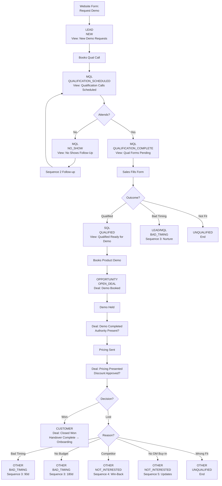

# HubSpot Sales Pipeline Master Plan - Consolidated

## Document Control

| Field | Value |
|-------|-------|
| **Version** | 1.0 |
| **Created** | 2026-02-03 |
| **Status** | Ready for Review |
| **Primary Owner** | Matt Maxted (HubSpot/Marketing) |
| **Process Owner** | Haidar (Sales Manager) |
| **Executive Sponsor** | Stelios Ioannou |

**Source Documents Consolidated:**
- `Hubspot_masterplan_mm.md` (PRIMARY)
- `CONSOLIDATED_REQUIREMENTS_EXTRACTION.md`
- All supporting specification documents

---

## Table of Contents

1. [Overview & Objectives](#1-overview--objectives)
2. [Lifecycle Stage Configuration](#2-lifecycle-stage-configuration)
3. [Lead Status Property Setup](#3-lead-status-property-setup)
4. [Pre-Pipeline Contact Views](#4-pre-pipeline-contact-views)
5. [Deal Pipeline Configuration](#5-deal-pipeline-configuration)
6. [Required Properties](#6-required-properties)
7. [Stage Gating & Progression Controls](#7-stage-gating--progression-controls)
8. [Automated Workflows](#8-automated-workflows)
9. [Sales Sequences](#9-sales-sequences)
10. [Closed Lost Conditional Routing](#10-closed-lost-conditional-routing)
11. [Sales-to-Onboarding Handover](#11-sales-to-onboarding-handover)
12. [Permissions & Governance](#12-permissions--governance)
13. [Timestamp & Duration Tracking](#13-timestamp--duration-tracking)
14. [Dashboards & Reporting](#14-dashboards--reporting)
15. [Custom Reports](#15-custom-reports)
16. [Automated Alerts](#16-automated-alerts)
17. [Notification Rules](#17-notification-rules)
18. [Data Integrity & Cleanup](#18-data-integrity--cleanup)
19. [Success Metrics & KPIs](#19-success-metrics--kpis)
20. [Implementation Timeline](#20-implementation-timeline)
21. [Acceptance Testing Checklist](#21-acceptance-testing-checklist)
22. [Key Personnel](#22-key-personnel)

---

## 1. Overview & Objectives

### Purpose

This plan establishes a controlled sales process for StoneRise Technology where:
- Leads are managed through **contact views** until demo booking
- Transition to **deal-based management** with strict stage progression controls
- All email communications via **Sales Sequences** (not workflow emails) to avoid marketing contact consumption
- Full governance, tracking, and reporting throughout the funnel

### Design Principles

1. **Single Pipeline Architecture** - One "StoneRise Sales Pipeline" for all deals
2. **Contact-Level Qualification** - Qualification happens before deal creation
3. **Deal = Opportunity Only** - Deals created only when product demo is booked
4. **Sequences Over Workflows** - No workflow emails; all communications via sales sequences
5. **Governance First** - Stage gates, required fields, and approval workflows
6. **Module-Ready Design** - Properties support future multi-module expansion

### Architecture Decisions

| Decision | Approach | Rationale |
|----------|----------|-----------|
| Pipeline count | Single pipeline | Simplicity for initial launch; properties support future split |
| Email delivery | Sales Sequences only | Avoids marketing contact consumption |
| Enterprise deals | Deal Type property | Filter/report by type, not separate pipeline |
| Qualification | Contact-level properties | Contacts qualified before becoming deals |
| Stage gates | Required fields + validation workflows | Double enforcement for data integrity |

---

## 2. Lifecycle Stage Configuration

Configure HubSpot lifecycle stages to track contact progression:

### Stages

| Stage | Description | Trigger |
|-------|-------------|---------|
| **Subscriber** | Known contact, no buying intent | Newsletter signup, content download |
| **Lead** | Potential buyer, light interest | "Request a Demo" form submission |
| **MQL** | Marketing believes likely buyer | Qualification call booked |
| **SQL** | Sales actively pursuing | Qualification passed |
| **Opportunity** | Demo booked, deal exists | Product demo scheduled |
| **Customer** | Closed won | Payment received |
| **Other** | Closed Lost / Do Not Contact | Deal lost or explicit opt-out |

### Automation Rules

```
Form "Request a Demo" submitted → Lead + auto-email with qualification meeting link
Qualification meeting booked → MQL
Qualification form completed (Qualified) → SQL
Product demo meeting booked → Opportunity (deal created)
Deal Closed Won → Customer
Deal Closed Lost → Other
```

**Note:** HubSpot automatically tracks time in each lifecycle stage via native properties (Date entered, Date exited, Latest time, Cumulative time).

---

## 3. Lead Status Property Setup

Create custom **Lead Status** property (single select dropdown) for sub-stage tracking:

### Values

| Status | Description | Active View |
|--------|-------------|-------------|
| **NEW** | Submitted demo request, not yet booked call | New Demo Requests |
| **QUALIFICATION_SCHEDULED** | Discovery call booked, awaiting call | Qualification Calls Scheduled |
| **QUALIFICATION_COMPLETE** | Call held, form pending completion | Qualification Forms Pending |
| **QUALIFIED** | Passed qualification, ready for demo | Qualified - Ready for Demo |
| **NO_SHOW** | Missed qualification call | No Shows - Follow Up |
| **OPEN_DEAL** | Deal exists (auto-set) | (Managed in pipeline) |
| **BAD_TIMING** | Good fit but not right now | Bad Timing Follow-Ups |
| **NOT_INTERESTED** | Good fit, try again later | Re-Engagement Candidates |
| **UNQUALIFIED** | Not a fit | (No active view) |
| **DO_NOT_CONTACT** | Explicit opt-out | (No active view) |

### Field Settings

- **Required:** Yes (on contact record)
- **Editable by:** Sales team
- **Auto-update:** Via workflows where possible

---

## 4. Pre-Pipeline Contact Views

Create 7 filtered contact views for sales team:

### View 1: "New Demo Requests - Need Qualification Call"

| Filter | Value |
|--------|-------|
| Lifecycle Stage | Lead |
| Lead Status | NEW |
| Qualification Meeting Booked | False |
| Create Date | Last 30 days |

**Purpose:** Fresh demo requests awaiting self-booking of qualification call

---

### View 2: "Qualification Calls Scheduled"

| Filter | Value |
|--------|-------|
| Lifecycle Stage | MQL |
| Lead Status | QUALIFICATION_SCHEDULED |
| Qualification Call Date | Today OR Next 7 days |
| Associated Deal | None |

**Purpose:** Upcoming discovery calls requiring prep

---

### View 3: "Qualification Forms Pending"

| Filter | Value |
|--------|-------|
| Lifecycle Stage | MQL |
| Lead Status | QUALIFICATION_COMPLETE |
| Qualification Form Completed | False |
| Qualification Call Date | < Today |
| Associated Deal | None |

**Purpose:** Calls completed, qualification form not yet filled by sales

---

### View 4: "Qualified - Ready for Demo Booking"

| Filter | Value |
|--------|-------|
| Lifecycle Stage | SQL |
| Lead Status | QUALIFIED |
| Associated Deal | None |

**Purpose:** Passed qualification, needs product demo booking

---

### View 5: "No Shows - Follow Up Required"

| Filter | Value |
|--------|-------|
| Lead Status | NO_SHOW |
| Qualification Call Date | Last 7 days |

**Purpose:** Missed qualification calls needing follow-up

---

### View 6: "Bad Timing Follow-Ups"

| Filter | Value |
|--------|-------|
| Lead Status | BAD_TIMING |
| Next Follow-Up Date | ≤ Today + 14 days |

**Purpose:** Re-engage timing-based losses

---

### View 7: "Re-Engagement Candidates"

| Filter | Value |
|--------|-------|
| Lead Status | NOT_INTERESTED |
| Re-Engagement Date | ≤ Today |

**Purpose:** Contacts ready to retry after X months

---

## 5. Deal Pipeline Configuration

### Pipeline: "StoneRise Sales Pipeline"

#### Stage 1: Demo Booked (20% probability)

**Entry Requirement:**
- Product demo meeting scheduled in HubSpot calendar
- Procurement Problem Confirmed = Yes (NEW - critical gate)

**Inherited Properties from Qualification:**
- Contact Role
- Company Size
- Current Software Used
- Primary Module Interest
- Key Pain Points
- Budget Indication
- Qualification Notes

**Exit Requirement:**
- Demo meeting marked complete
- Demo notes logged

---

#### Stage 2: Demo Completed (40% probability)

**Entry Requirement:** Stage 1 exit requirements met

**Required Properties:**
- Demo Recording Link (URL)
- Demo Notes (text area)
- Confirmed Budget Range
- Confirmed Timeline
- Modules Demonstrated (multi-checkbox)
- Next Steps Agreed (text area)
- Authority Present on Demo (Yes/No) - **NEW - critical gate**

**Exit Requirement:**
- All properties complete
- Ready for Pricing = Yes
- Authority Present on Demo = Yes

---

#### Stage 3: Pricing Presented & Decision Pending (60% probability)

**Entry Requirement:** Stage 2 exit requirements met + Authority Present = Yes

**Required Properties:**
- Pricing Sent Date (auto-populated)
- Pricing Sent Method (dropdown)
- Decision Maker Email Confirmed (checkbox)
- Proposal Document Link
- Expected Decision Date
- Discount Requested (Yes/No) - **NEW**
- Discount Approved (Yes/No) - **NEW** (required if discount requested)
- Discount Justification (text) - **NEW** (required if discount requested)

**Exit Requirement:**
- Manual progression only
- Won/lost reason documented
- If discount requested: Discount Approved = Yes

---

#### Stage 4: Closed Won (100% probability)

**Entry Requirement:**
- Stage 3 exit requirements met
- Contract Signed = Yes
- Handover Completed = Yes - **NEW - critical gate**

**Required Properties:**
- Contract Signed Date (auto-populated)
- Payment Method
- Payment Received Date
- Contract Value (Annual)
- Modules Purchased (multi-select)
- Handover Completed (Yes/No) - **NEW**
- Start Date - **NEW**

**Exit Actions:**
1. Update Lifecycle Stage → Customer
2. Update Lead Status → OPEN_DEAL
3. Trigger onboarding workflow
4. Notify Customer Success Manager (David Adair)
5. Create tasks in customer success pipeline

---

#### Stage 5: Closed Lost (0% probability)

**Entry Requirement:** Manual progression from any stage

**Required Properties:**
- Lost Reason (dropdown)
- Lost Reason Details (text area)
- Competitor Name (conditional)
- Follow-Up Strategy (dropdown)

**Lost Reason Values:**
- Price too high
- Competitor chosen
- No budget
- Bad timing
- Not the right fit
- No decision maker buy-in
- Other

**Exit Actions:** See Section 10 (Closed Lost Conditional Routing)

---

## 6. Required Properties

### 6.1 Contact Properties (Qualification)

| Property | Type | Required | Purpose |
|----------|------|----------|---------|
| Qualification Form Completed | Checkbox | - | Triggers workflow |
| Qualification Call Date | DateTime | - | Auto from meeting |
| Qualification Meeting Booked | Checkbox | - | Auto-populated |
| Qualification Outcome | Dropdown | Yes | Qualified / Not a Fit / Bad Timing |
| **Procurement Problem Confirmed** | Yes/No | Yes | **CRITICAL GATE** - required for Demo Booked |
| Contact Role | Dropdown | Yes | Decision Maker / Influencer / Champion / End User |
| Company Size | Number | Yes | - |
| Current Software Used | Text | - | - |
| Primary Module Interest | Multi-checkbox | Yes | Procurement / HR / Commercial / H&S / Site Management |
| Key Pain Points | Multi-checkbox | Yes | Manual processes / No visibility / Poor supplier mgmt / Compliance / Cost control / Other |
| Budget Indication | Dropdown | Yes | £0-500/mo / £500-1000/mo / £1000-2500/mo / £2500+/mo / Not Discussed |
| Timeline to Decision | Dropdown | Yes | <1 month / 1-3 months / 3-6 months / 6+ months / Exploring |
| Decision Making Process | Text area | - | - |
| Qualification Notes | Text area | Yes | - |

---

### 6.2 Deal Properties

#### Budget & Timeline Fields

| Property | Type | Stage Required |
|----------|------|----------------|
| Budget Range | Dropdown | Demo Completed |
| Timeline to Decision | Dropdown | Demo Completed |
| Decision Making Process | Text | Demo Completed |
| Key Pain Points | Multi-checkbox | Demo Completed |
| Demo Recording Link | URL | Demo Completed |
| **Authority Present on Demo** | Yes/No | Demo Completed |

#### Pricing Fields

| Property | Type | Stage Required |
|----------|------|----------------|
| Pricing Sent Date | Date | Pricing Presented |
| Pricing Sent Method | Dropdown | Pricing Presented |
| Decision Maker Email Confirmed | Checkbox | Pricing Presented |
| Proposal Document Link | File/URL | Pricing Presented |
| Expected Decision Date | Date | Pricing Presented |
| **Discount Requested** | Yes/No | Pricing Presented |
| **Discount Approved** | Yes/No | Pricing Presented (conditional) |
| **Discount Justification** | Text area | Pricing Presented (conditional) |

#### Closed Won Fields

| Property | Type | Stage Required |
|----------|------|----------------|
| Contract Signed Date | Date | Closed Won |
| Payment Method | Dropdown | Closed Won |
| Payment Received Date | Date | Closed Won |
| Contract Value | Currency | Closed Won |
| Modules Purchased | Multi-checkbox | Closed Won |
| **Handover Completed** | Yes/No | Closed Won |
| **Start Date** | Date | Closed Won |
| **Handover Risks** | Text area | Closed Won |

#### Closed Lost Fields

| Property | Type | Stage Required |
|----------|------|----------------|
| Lost Reason | Dropdown | Closed Lost |
| Lost Reason Details | Text area | Closed Lost |
| Competitor Name | Text | Closed Lost (conditional) |
| Follow-Up Strategy | Dropdown | Closed Lost |

#### Deal Health & Tracking

| Property | Type | Purpose |
|----------|------|---------|
| **Deal Type** | Dropdown | SME / Mid-Market / Enterprise |
| **Deal Health** | Dropdown | Healthy / At Risk / Stalled |

---

## 7. Stage Gating & Progression Controls

### Method 1: Required Properties (Native HubSpot)

Configure required properties per deal stage in Pipeline Settings:
- Sales cannot progress until all required fields complete
- Visual indicators show incomplete fields

### Method 2: Validation Workflows (Recommended)

Create validation workflows for each stage transition:

#### Gate 1: Demo Booked Entry

```
Trigger: Deal stage = "Demo Booked"
Condition: Procurement Problem Confirmed = Yes (on associated contact)
IF No → Revert to previous state + Create task for rep
IF Yes → Allow
```

#### Gate 2: Demo Completed → Pricing Presented

```
Trigger: Deal stage = "Pricing Presented"
Conditions:
  - Budget Range is NOT empty
  - Timeline is NOT empty  
  - Decision Making Process is NOT empty
  - Authority Present on Demo = Yes
IF any condition fails → Revert to "Demo Completed" + Task for rep
IF all pass → Allow
```

#### Gate 3: Pricing Presented → Closed Won

```
Trigger: Deal stage = "Closed Won"
Conditions:
  - Contract Signed = Yes
  - Handover Completed = Yes
  - Payment Method is NOT empty
IF any condition fails → Revert to "Pricing Presented" + Task for rep
IF all pass → Allow
```

#### Gate 4: Discount Approval Check

```
Trigger: Deal stage change AND Discount Requested = Yes
Conditions:
  - Discount Approved = Yes
  - Discount Justification is NOT empty
IF conditions fail → Block progression + Alert to Sales Manager
IF pass → Allow
```

---

## 8. Automated Workflows

### Workflow 1: Auto-Response on Demo Request

**Trigger:** Form submission: "Request a Demo"

**Actions:**
1. Update contact properties:
   - Lifecycle Stage → Lead
   - Lead Status → NEW
   - Contact Owner → Round-robin to sales team
   - `date_entered_new` → Current datetime
2. Enroll in **Sequence 1: Qualification Call Booking** (NOT workflow email)
3. Create task for assigned rep:
   - Title: "New demo request: [Contact Name] - [Company]"
   - Due: Today
   - Description: "Contact submitted demo request. Sequence enrollment triggered. Monitor for booking."
4. Add to daily digest for Haidar

---

### Workflow 2: Qualification Call Booked

**Trigger:** Meeting booked with type = "Qualification Call"

**Actions:**
1. Update contact properties:
   - Lifecycle Stage → MQL
   - Lead Status → QUALIFICATION_SCHEDULED
   - Qualification Call Date → Meeting datetime
   - Qualification Meeting Booked → True
   - `date_entered_qual_scheduled` → Current datetime
2. Calculate: `days_new_to_qual_scheduled`
3. Unenroll from Sequence 1
4. Mark "New demo request" task complete
5. Create new task: "Prep for qualification call: [Contact Name]"
   - Due: 1 day before call

---

### Workflow 3: Qualification Form Validation & SQL Promotion

**Trigger:** "Qualification Form Completed" = True

**Branch A: QUALIFIED**
- IF Qualification Outcome = "Qualified" AND all required fields complete
- THEN:
  - Lifecycle Stage → SQL
  - Lead Status → QUALIFIED
  - `date_entered_qualified` → Current datetime
  - Calculate duration fields
  - Create task: "Book product demo with [Contact Name]" (Due: 2 days)

**Branch B: UNQUALIFIED**
- IF Qualification Outcome = "Not a Fit"
- THEN:
  - Lead Status → UNQUALIFIED
  - No follow-up actions

**Branch C: BAD TIMING**
- IF Qualification Outcome = "Bad Timing"
- THEN:
  - Lead Status → BAD_TIMING
  - Create follow-up task (date from notes)
  - Enroll in **Sequence 3: Bad Timing Nurture**

---

### Workflow 4: Qualification Call No-Show Handler

**Trigger:** Meeting type = "Qualification Call" AND Outcome = "No Show"

**Actions:**
1. Update Lead Status → NO_SHOW
2. `date_entered_no_show` → Current datetime
3. Enroll in **Sequence 2: No-Show Follow-Up** (NOT workflow email)
4. Create task: "Follow up: No-show for [Contact Name]" (Due: Tomorrow)
5. If no response after 7 days → Update to NOT_INTERESTED

---

### Workflow 5: Auto-Create Deal on Product Demo Booking

**Trigger:** Meeting booked with type = "Product Demo"

**Actions:**
1. Check if deal exists for contact
   - IF yes → End workflow
   - IF no → Continue
2. Verify contact is SQL lifecycle stage
   - IF not SQL → Alert to sales manager (data integrity)
3. Create new deal:
   - Name: "[Company Name] - [Primary Module] - [Month/Year]"
   - Pipeline: StoneRise Sales Pipeline
   - Stage: Demo Booked
   - Owner: Contact owner (inherited)
   - Associated contacts: Primary + meeting attendees
   - Close date: +30 days from demo
4. Update contact:
   - Lifecycle Stage → Opportunity
   - Lead Status → OPEN_DEAL
   - `date_entered_open_deal` → Current datetime
5. Calculate: `days_qualified_to_opportunity`
6. Create task: "Prepare product demo for [Contact Name]" (Due: 1 day before)
7. Notify Haidar

---

### Workflow 6: Discount Approval Routing (NEW)

**Trigger:** Discount Requested = Yes

**Actions:**
1. Create approval task for Sales Manager (Haidar):
   - Title: "Discount approval needed: [Deal Name]"
   - Include: Discount %, justification, deal value
   - Due: Today
2. Send internal notification to Haidar
3. IF Discount % > 15%:
   - Escalate to Leadership (Stelios)
   - Create additional approval task
4. Block deal progression until Discount Approved = Yes
5. Log approval/rejection in deal timeline

---

## 9. Sales Sequences

**CRITICAL:** All email communications via Sales Sequences, NOT workflow emails, to avoid marketing contact consumption.

### Sequence 1: Qualification Call Booking

**Enrollment:** Workflow 1 (demo request form submission)
**Purpose:** Encourage contact to self-book qualification call
**Auto-unenroll:** When qualification call is booked

| Step | Day | Type | Content |
|------|-----|------|---------|
| 1 | 0 | Email | "Thanks for your interest in StoneRise - Let's talk" - Value prop + meeting link |
| 2 | 2 | Email | "Quick question about [Company]'s construction processes" - Social proof + meeting link |
| 3 | 5 | Email | "Last chance to see if StoneRise is right for [Company]" - Final reminder |

---

### Sequence 2: No-Show Follow-Up

**Enrollment:** Workflow 4 (qualification call no-show)
**Purpose:** Re-engage no-shows to reschedule
**Auto-unenroll:** When meeting rescheduled or task complete

| Step | Day | Type | Content |
|------|-----|------|---------|
| 1 | 0 | Task | "Call [Contact] - No-show follow-up" (Due: Today) |
| 2 | 0 | Email | "We missed you! Let's reschedule" (1hr after no-show) |
| 3 | 2 | Email | "Still interested in improving [pain point]?" - Case study + reschedule link |
| 4 | 7 | Task | "Final no-show follow-up attempt" - Mark NOT_INTERESTED if no response |

---

### Sequence 3: Bad Timing Nurture

**Enrollment:** Workflow 3 Branch C (qualification outcome = Bad Timing)
**Purpose:** Stay top of mind for future consideration
**Auto-unenroll:** When follow-up task complete or contact responds

| Step | Day | Type | Content |
|------|-----|------|---------|
| 1 | 7 | Email | "Staying in touch - StoneRise updates" - Helpful resource |
| 2 | 30 | Email | "New feature: [Relevant Module]" - Product update + customer story |
| 3 | 60 | Email | "Has anything changed at [Company]?" - Check-in + meeting link |
| 4 | 90 | Task | "Re-engage bad timing lead: [Contact]" |

---

### Sequence 4: Competitive Win-Back

**Enrollment:** Closed Lost workflow (lost reason = Competitor Chosen)
**Purpose:** Win back contacts who chose competitor
**Auto-unenroll:** When task complete or contact responds

| Step | Day | Type | Content |
|------|-----|------|---------|
| 1 | 30 | Email | "How's [Competitor] working out?" - No hard feelings + differentiator |
| 2 | 90 | Email | "New in StoneRise: [Feature]" - Address competitive gap |
| 3 | 180 | Email | "[Company] - Contract renewal coming up?" - Comparison offer |
| 4 | 180 | Task | "Competitive win-back: [Contact]" - Pre-renewal outreach |

---

### Sequence 5: Product Update Engagement

**Enrollment:** Closed Lost workflow (lost reason = No Budget / No Decision Maker Buy-In)
**Purpose:** Re-engage with product value over time
**Auto-unenroll:** When task complete or contact responds

| Step | Day | Type | Content |
|------|-----|------|---------|
| 1 | 60 | Email | "What's new at StoneRise" - Product updates + ROI content |
| 2 | 120 | Email | "[Industry Trend] - How StoneRise helps" - Thought leadership |
| 3 | 180 | Task | "Re-engage: [Contact] - Budget/approval cycle" |

---

## 10. Closed Lost Conditional Routing

### Workflow: Closed Lost - Conditional Actions

**Trigger:** Deal stage = Closed Lost

#### Branch 1: Bad Timing
- Lead Status → BAD_TIMING
- Create task: "Re-engage [Company] - Previously bad timing" (Due: +90 days)
- Enroll in Sequence 3: Bad Timing Nurture

#### Branch 2: No Budget
- Lead Status → BAD_TIMING
- Create task: "Re-engage [Company] - Budget availability check" (Due: +180 days)
- Enroll in Sequence 3: Bad Timing Nurture

#### Branch 3: Competitor Chosen
- Lead Status → NOT_INTERESTED
- Create task: "Competitive win-back: [Company] chose [Competitor]" (Due: +180 days)
- Enroll in Sequence 4: Competitive Win-Back
- Add to "Competitive Intelligence" list

#### Branch 4: No Decision Maker Buy-In
- Lead Status → NOT_INTERESTED
- Create task: "Re-approach [Company] with executive outreach" (Due: +180 days)
- Enroll in Sequence 5: Product Update Engagement

#### Branch 5: Not the Right Fit
- Lead Status → UNQUALIFIED
- No follow-up task
- Unenroll from all sequences
- No further automation

#### Branch 6: Do Not Contact
- Lead Status → DO_NOT_CONTACT
- Unenroll from ALL emails immediately
- Add to suppression list
- No follow-up tasks

---

## 11. Sales-to-Onboarding Handover

### Handover Template Requirements

Before marking Handover Completed = Yes, sales rep must document:

#### 1. Commercial & Decision Context
- Decision-maker name and role
- Operational owner (day-to-day user)
- Reason for purchase (business driver)

#### 2. Scope Agreed
- Users/pricing tier confirmed
- Teams or departments included
- Explicit exclusions

#### 3. Procurement Snapshot
- Current order method (email, spreadsheet, verbal, etc.)
- Main pain point (manual, no visibility, errors, compliance)

#### 4. Accounts Context
- Current accounting system
- Invoice approval process
- Finance team expectations

#### 5. Phase 1 Success Metrics
- Signal 1: What indicates value in first 30 days
- Signal 2: What indicates adoption success

#### 6. Commercial Guardrails
- Pricing tier and commitments
- Support level included
- Contract terms and renewal date

#### 7. Risk Flags
- Internal resistance or skepticism
- Unclear ownership or accountability
- Other implementation risks

#### OUT OF SCOPE (Discovery Tasks for Onboarding Team)
- Detailed workflows
- Supplier setup
- Approval chains
- Invoice matching rules
- User permissions

### Handover Workflow

**Trigger:** Handover Completed = Yes AND Deal Stage = Closed Won

**Actions:**
1. Notify Customer Success Manager (David Adair)
2. Create onboarding tasks in customer success pipeline
3. Update contact record with onboarding status
4. Schedule kickoff meeting

---

## 12. Permissions & Governance

### Pipeline Access Controls

| Role | Access Level |
|------|--------------|
| Sales Reps | View/edit own deals + team deals |
| Sales Manager (Haidar) | Full visibility, edit all deals, approve discounts ≤15% |
| Leadership (Stelios) | Full visibility, approve discounts >15% |
| Marketing (Matt) | Read-only pipeline, full contact access |
| Customer Success (David) | Read-only deals, edit customer records |

### Stage Progression Controls

- Enable "Deal stage must progress sequentially" in pipeline settings
- Only Sales Manager can move deals backwards (exception handling)
- Required field enforcement + validation workflows as secondary layer

### Discount Governance

| Discount Level | Approval Required | Approver |
|----------------|-------------------|----------|
| 0% (standard pricing) | None | - |
| 1-15% | Sales Manager | Haidar |
| >15% | Leadership | Stelios |

All discounts require written justification in `Discount Justification` field.

### Deal Health Tracking

| Status | Definition | Alert Trigger |
|--------|------------|---------------|
| Healthy | On track, regular activity, clear next steps | - |
| At Risk | Stalled >7 days, lack of authority, unclear decision | Weekly manager review |
| Stalled | No activity >14 days, ghosted contact | Immediate escalation |

---

## 13. Timestamp & Duration Tracking

### Native HubSpot Properties (Automatic)

HubSpot automatically tracks for each lifecycle stage:
- Date entered stage
- Date exited stage
- Latest time in stage (seconds)
- Cumulative time in stage (seconds)

**No setup required** - these populate automatically.

### Custom Lead Status Timestamps (Workflow-Populated)

| Property | Populated When |
|----------|----------------|
| `date_entered_new` | Lead Status = NEW |
| `date_entered_qual_scheduled` | Lead Status = QUALIFICATION_SCHEDULED |
| `date_entered_qual_complete` | Lead Status = QUALIFICATION_COMPLETE |
| `date_entered_qualified` | Lead Status = QUALIFIED |
| `date_entered_no_show` | Lead Status = NO_SHOW |
| `date_entered_open_deal` | Lead Status = OPEN_DEAL |

### Custom Duration Calculations

| Property | Calculation |
|----------|-------------|
| `days_new_to_qual_scheduled` | `date_entered_qual_scheduled` - `date_entered_new` |
| `days_qual_scheduled_to_attended` | Call held date - `date_entered_qual_scheduled` |
| `days_qual_complete_to_qualified` | `date_entered_qualified` - `date_entered_qual_complete` |
| `days_qualified_to_opportunity` | `date_entered_open_deal` - `date_entered_qualified` |

---

## 14. Dashboards & Reporting

### Dashboard 1: Pre-Pipeline Funnel Analysis

**Purpose:** Identify where contacts drop off before becoming opportunities

**Widgets:**
1. Funnel Conversion Rates (Lead → MQL → SQL → Opportunity)
2. Average Time in Each Stage (bar chart)
3. Fall-Off Point Identification (table with % drop-off)
4. Lead Status Distribution Over Time (stacked area)
5. Qualification Call Booking Rate (target: >60% within 7 days)
6. No-Show Rate (target: <20%)
7. Qualification Pass Rate by Rep
8. Aging Analysis (contacts stuck >X days)

---

### Dashboard 2: Deal Pipeline Health + Governance

**Purpose:** Monitor pipeline health and governance compliance

**Pipeline Health Widgets:**
1. Deal Stage Funnel (with conversion rates)
2. Average Days in Each Deal Stage
3. Pipeline Velocity Trend
4. Deal Stage Distribution (count + value)
5. Win/Loss Rate by Month

**Governance Widgets (NEW):**
6. Deals Without Authority Confirmed
7. Deals with Discounts Pending Approval
8. Deals Won Without Handover Completed
9. Deal Health Distribution (Healthy/At Risk/Stalled)
10. Deals at Risk (Pricing >30 days, Demo Completed >14 days)

---

### Dashboard 3: Sales Manager Overview

**Layout Order:** Governance metrics BEFORE activity metrics

**Governance Section:**
1. Complete Funnel Metrics (single number cards)
2. Pipeline Forecast (probability-weighted)
3. Bottleneck Identification (alerts)
4. Discount & Handover Compliance
5. Undefined Decision Timeline Deals

**Activity Section (For Trend Analysis Only - NOT Rep Ranking):**
6. Qualification calls held by rep
7. Product demos delivered by rep
8. Proposals sent
9. Module Interest Heatmap

**Time-to-Value Benchmarks:**
10. Form → Qual booked: Target <3 days
11. Qual booked → Call held: Target <5 days
12. SQL → Demo booked: Target <7 days
13. Lead → Opportunity: Target <14 days
14. Opportunity → Customer: Target <30 days

---

### Dashboard 4: Lead Source & Attribution Analysis

**Widgets:**
1. Lead Source Funnel Performance (table)
2. Average Conversion Time by Source
3. Cost per SQL / Cost per Customer (if ad spend tracked)

---

### Dashboard 5: Enterprise Pipeline (Leadership View) - NEW

**Purpose:** Consolidated view of large, complex opportunities
**Filter:** Deal Type = Enterprise AND Stage ≠ Closed Lost

**Widgets:**
1. Enterprise Pipeline by Company (table)
2. Enterprise Pipeline Value by Module (bar/pie)
3. Enterprise Deals by Stage (funnel)
4. Risk Reports: Deals without authority, At Risk/Stalled, Undefined timeline
5. Commercial Exposure: Deals with discounts, Discounted ACV
6. Win/Loss Analysis (quarterly)

**Excludes:** Calls, emails, meetings, SDR activity metrics

**Review Cadence:**
- Weekly: Leadership review
- Monthly: Risk assessment
- Quarterly: Win/loss analysis

---

## 15. Custom Reports

### Report 1: Stage Drop-Off Detail

**Filters:**
- Date range selector
- Lifecycle stage = Lead, MQL, or SQL
- Group by: Lead Status

**Columns:** Contact name, Company, Lead Status, Date entered, Days in status, Last activity, Owner, Source

**Purpose:** Identify stuck contacts and diagnose why

---

### Report 2: Qualification Call Conversion Analysis

**Filters:**
- Date became MQL = Last 90 days
**Group by:** Owner

**Columns:** Contact, Company, Call booked date, Call held date, Outcome, Days booked→held, No-show?, Owner

**Purpose:** Track rep performance on qualification calls

---

### Report 3: SQL → Opportunity Conversion Tracking

**Filters:**
- Date became SQL = Last 90 days
- Lifecycle stage = SQL or Opportunity

**Columns:** Contact, Company, Date became SQL, Date became Opportunity, Days as SQL, Has deal?, Owner

**Purpose:** Track how long SQLs take to book demos

---

### Report 4: Complete Journey Timeline

**Filters:**
- Date became Lead = Last 90 days

**Columns:** Contact, Company, Date Lead, Date MQL, Date SQL, Date Opportunity, Date Customer, Total journey days, Current stage, Owner

**Purpose:** End-to-end visibility of contact progression

---

## 16. Automated Alerts

### Alert 1: Qualification Call Not Booked
- **Trigger:** Lead Status = NEW for >5 days
- **Action:** Alert to contact owner + high-priority task
- **Message:** "Contact has not booked qualification call after 5 days - manual outreach needed"

### Alert 2: Qualification Call No-Show
- **Trigger:** Lead Status changes to NO_SHOW
- **Action:** Immediate notification to rep + manager
- **Message:** "No-show detected. Auto follow-up sent, needs manual outreach."

### Alert 3: Qualification Form Not Completed
- **Trigger:** Lead Status = QUALIFICATION_COMPLETE for >2 days
- **Action:** Reminder to sales rep
- **Message:** "Complete qualification form for [Contact] - call was X days ago"

### Alert 4: SQL Stagnant - No Demo Booked
- **Trigger:** Lead Status = QUALIFIED for >10 days
- **Action:** Alert to rep + manager
- **Message:** "SQL qualified 10+ days without demo booking - review and action"

### Alert 5: Deal Stage Stagnation
- **Trigger:** Deal in "Demo Completed" >14 days OR "Pricing Presented" >30 days
- **Action:** Alert to rep + manager
- **Message:** "Deal at risk - stuck in [stage] for X days"

---

## 17. Notification Rules

### For Sales Reps

| Event | Notification Type |
|-------|-------------------|
| New lead assigned | Email + in-app |
| Qualification call scheduled | Email 24hrs before |
| Product demo scheduled | Email 24hrs before |
| Qualification form not completed (2 days) | Reminder task |
| SQL not progressed (10 days) | Alert task |
| Deal stuck in stage (14+ days) | Task created |
| Follow-up task due | Email morning of |

### For Sales Manager (Haidar)

| Event | Notification Type |
|-------|-------------------|
| New demo request | Daily digest (9am) |
| Qualification call no-show | Immediate alert |
| SQL stagnant >10 days | Daily digest |
| Deal at risk | Weekly digest |
| Deal Closed Won | Immediate |
| Deal Closed Lost | Immediate with reason |
| Discount approval needed | Immediate |
| Weekly funnel summary | Monday 9am |
| Monthly report | 1st of month 9am |

### For Customer Success (David Adair)

| Event | Notification Type |
|-------|-------------------|
| Deal Closed Won | Immediate |
| Handover completed | Onboarding workflow triggered |

### For Leadership (Stelios)

| Event | Notification Type |
|-------|-------------------|
| Monthly performance summary | 1st of month 10am |
| Major deal milestone (>£5k MRR) | Immediate |
| Discount approval >15% | Immediate |

---

## 18. Data Integrity & Cleanup

### Duplicate Prevention

Enable automatic detection on:
- Email address (contacts)
- Company domain (companies)
- Company name + contact email (deals)

### Data Validation Rules

- Email format validation on forms
- Phone number formatting (UK format)
- Required field enforcement on contact creation

### Regular Cleanup Tasks

| Frequency | Task |
|-----------|------|
| Weekly | Review NEW status >7 days - manual outreach or mark not interested |
| Weekly | Review NO_SHOW status - ensure follow-up actions taken |
| Monthly | Review SQL >30 days with no demo - reassess or mark bad timing |
| Quarterly | Review BAD_TIMING contacts - update status |
| Quarterly | Audit timestamp properties for accuracy |

---

## 19. Success Metrics & KPIs

### Pre-Pipeline Metrics

| Metric | Target |
|--------|--------|
| Qualification call booking rate | >60% (within 7 days) |
| No-show rate | <20% |
| Days NEW → QUAL_SCHEDULED | <3 days |
| Days QUAL_SCHEDULED → Call held | <5 days |
| Days SQL → Demo booked | <7 days |

### Deal Pipeline Metrics

| Metric | Target |
|--------|--------|
| Demo Booked → Demo Completed | Track % |
| Demo Completed → Pricing Presented | Track % |
| Pricing Presented → Closed Won | Track % |
| Average Demo Booked → Closed Won | <30 days |

### Governance Metrics

| Metric | Target |
|--------|--------|
| % deals with Procurement Problem Confirmed before demo | 100% |
| % deals with Authority Present on demos | >80% |
| % deals with approved handover before Closed Won | 100% |
| Discount approval turnaround time | <24 hours |

### Quality Metrics

| Metric | Target |
|--------|--------|
| Deal Health distribution (Healthy) | >70% |
| Deals stalled >14 days | <10% |
| Customer onboarding completion rate | >95% |
| Phase 1 success signal achievement | >80% |

---

## 20. Implementation Timeline

### Week 1: Foundation

| Task | Owner |
|------|-------|
| Configure lifecycle stages | Matt |
| Create Lead Status property | Matt |
| Create custom contact properties for qualification | Matt |
| Create custom deal properties | Matt |
| Build 7 pre-pipeline contact views | Matt |
| Configure pipeline with required fields | Matt |

### Week 2: Forms & Meetings

| Task | Owner |
|------|-------|
| Create "Request a Demo" form | Matt |
| Set up Qualification Call meeting link (15-30 min) | Matt |
| Set up Product Demo meeting link (45-60 min) | Matt |
| Create qualification form template for sales | Matt |
| Create handover form template | Matt |

### Week 2-3: Automation

| Task | Owner |
|------|-------|
| Build Workflow 1: Demo request handler | Matt |
| Build Workflow 2: Qualification call booked | Matt |
| Build Workflow 3: Qualification form validation | Matt |
| Build Workflow 4: No-show handler | Matt |
| Build Workflow 5: Deal creation | Matt |
| Build Workflow 6: Discount approval routing | Matt |
| Create 5 sales sequences | Matt |
| Build stage validation workflows | Matt |
| Build closed lost routing workflow | Matt |
| Build 5 automated alert workflows | Matt |
| Configure notifications | Matt |

### Week 3: Reporting

| Task | Owner |
|------|-------|
| Create Dashboard 1: Pre-Pipeline Funnel | Matt |
| Create Dashboard 2: Deal Pipeline Health + Governance | Matt |
| Create Dashboard 3: Sales Manager Overview | Matt |
| Create Dashboard 4: Lead Source Attribution | Matt |
| Create Dashboard 5: Enterprise Pipeline | Matt |
| Build 4 custom reports | Matt |
| Set up weekly/monthly reporting emails | Matt |

### Week 3-4: Testing

| Task | Owner |
|------|-------|
| Test complete funnel (Form → Customer) | Matt + Haidar |
| Test all 5 sales sequences | Matt |
| Test no-show scenario | Matt |
| Test all 5 alert workflows | Matt |
| Test discount approval workflow | Matt + Haidar |
| Validate stage gates | Matt |
| Verify dashboards populate correctly | Matt |
| Confirm NO marketing contacts consumed | Matt |
| Complete acceptance checklist | Matt + Haidar |

### Week 4: Training & Launch

| Task | Owner |
|------|-------|
| Train sales team on qualification form | Haidar |
| Train sales team on contact views | Haidar |
| Train sales team on deal progression | Haidar |
| Train sales team on sequence management | Haidar |
| Train sales team on dashboard interpretation | Matt |
| Update website with new form | Matt |
| Go live | Team |
| Monitor daily for first week | Matt |
| Adjust based on feedback | Team |

---

## 21. Acceptance Testing Checklist

### 1. Pipeline Structure
- [ ] Single "StoneRise Sales Pipeline" exists
- [ ] 5 stages match specification exactly
- [ ] Stages in correct order
- [ ] No extra or renamed stages

### 2. Deal Properties
- [ ] All qualification properties created
- [ ] All demo properties created (including Authority Present on Demo)
- [ ] All pricing & decision properties created
- [ ] Discount governance properties configured
- [ ] Handover properties exist
- [ ] Deal Type and Deal Health properties configured

### 3. Stage Gating
- [ ] Demo Booked gated by Procurement Problem Confirmed
- [ ] Pricing Presented gated by Demo Delivered + Authority Present
- [ ] Closed Won gated by Contract Signed + Handover Completed
- [ ] Discount approval required when Discount Requested = Yes

### 4. Workflows
- [ ] Workflow 1: Demo request handler tested
- [ ] Workflow 2: Qualification call booked tested
- [ ] Workflow 3: Qualification form validation tested
- [ ] Workflow 4: No-show handler tested
- [ ] Workflow 5: Deal creation tested
- [ ] Workflow 6: Discount approval routing tested
- [ ] Stage validation workflows tested
- [ ] Closed Lost routing tested

### 5. Sales Sequences
- [ ] Sequence 1: Qualification Call Booking created and tested
- [ ] Sequence 2: No-Show Follow-Up created and tested
- [ ] Sequence 3: Bad Timing Nurture created and tested
- [ ] Sequence 4: Competitive Win-Back created and tested
- [ ] Sequence 5: Product Update Engagement created and tested
- [ ] NO marketing contacts consumed by sequences

### 6. Dashboards
- [ ] Dashboard 1: Pre-Pipeline Funnel configured
- [ ] Dashboard 2: Deal Pipeline Health + Governance configured
- [ ] Dashboard 3: Sales Manager Overview configured
- [ ] Dashboard 4: Lead Source Attribution configured
- [ ] Dashboard 5: Enterprise Pipeline configured (if applicable)
- [ ] Activity metrics labeled "For Trend Analysis Only"

### 7. Permissions
- [ ] Sales reps: view/edit own deals
- [ ] Manager (Haidar): view/edit all deals + approve discounts ≤15%
- [ ] Leadership (Stelios): full visibility + approve discounts >15%
- [ ] Marketing (Matt): read-only pipeline

### 8. End-to-End Testing
- [ ] Test path: Form → Lead → MQL → SQL → Opportunity → Won
- [ ] Test path: Form → Lead → Unqualified → Lost
- [ ] Test path: No-show → Follow-up → Reschedule
- [ ] Test path: Bad timing → Nurture → Re-engage
- [ ] Test path: Demo → Pricing → Lost (competitor) → Win-back
- [ ] Test discount approval flow (≤15% and >15%)
- [ ] Test handover completion gate
- [ ] Verify all dashboard metrics populate correctly

### 9. Sign-Off

| Role | Name | Signature | Date |
|------|------|-----------|------|
| Sales Lead | Haidar | _________ | _____ |
| HubSpot/Marketing Owner | Matt Maxted | _________ | _____ |
| Executive Approval | Stelios Ioannou | _________ | _____ |

**Approved for Go-Live:** ☐ Yes ☐ No

---

## 22. Key Personnel

| Role | Name | Responsibilities |
|------|------|------------------|
| **Sales Manager** | Haidar | Process owner, discount approval (≤15%), training lead, weekly governance review, acceptance sign-off |
| **HubSpot/Marketing Owner** | Matt Maxted | HubSpot configuration, form setup, lead source tracking, reporting, marketing contact management |
| **Executive Sponsor** | Stelios Ioannou | Final build approval, discount approval (>15%), monthly performance review, strategic decisions |
| **Customer Success** | David Adair | Closed Won handover notifications, onboarding workflow, Phase 1 success tracking |
| **Executive Assistant** | Maria Feliciano | Administrative support, HubSpot admin backup, training coordination |

---

## Appendix A: Journey Flow Diagram



---

## Appendix B: Quick Reference Cards

### Lifecycle Stages

| Stage | Description | Trigger |
|-------|-------------|---------|
| Lead | Potential buyer | Form submission |
| MQL | Likely buyer | Qual call booked |
| SQL | Sales pursuing | Qualification passed |
| Opportunity | Demo booked | Product demo scheduled |
| Customer | Closed won | Payment received |
| Other | Closed lost | Deal lost |

### Lead Status Values

| Status | When Used | Active View |
|--------|-----------|-------------|
| NEW | Form submitted | New Demo Requests |
| QUALIFICATION_SCHEDULED | Call booked | Qualification Calls Scheduled |
| QUALIFICATION_COMPLETE | Call attended | Qualification Forms Pending |
| QUALIFIED | Passed qualification | Qualified - Ready for Demo |
| NO_SHOW | Missed call | No Shows - Follow Up |
| OPEN_DEAL | Deal exists | (Pipeline) |
| BAD_TIMING | Good fit, wrong time | Bad Timing Follow-Ups |
| NOT_INTERESTED | Try again later | Re-Engagement Candidates |
| UNQUALIFIED | Not a fit | - |
| DO_NOT_CONTACT | Opted out | - |

### Critical Stage Gates

| Gate | Required Property | Value |
|------|-------------------|-------|
| → Demo Booked | Procurement Problem Confirmed | Yes |
| → Pricing Presented | Authority Present on Demo | Yes |
| → Closed Won | Handover Completed | Yes |
| → Closed Won | Contract Signed | Yes |
| Any progression | Discount Approved | Yes (if discount requested) |

---

**Document End**

*Next Action: Review with Haidar and Stelios before implementation*
