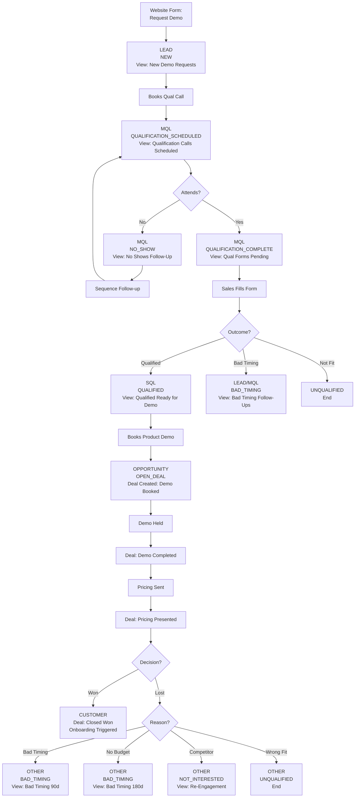

# HubSpot Sales Pipeline Setup Plan

## Overview

This plan establishes a controlled sales process where leads are managed through contact views until demo booking, then transition to deal-based management with strict stage progression controls.

---

## 1. Lifecycle Stage Configuration

Configure HubSpot lifecycle stages to track contact progression:

**Stages to use:**

- **Subscriber** - Known contact, no clear buying intent
- **Lead** - Potential buyer, light interest
- **MQL (Marketing Qualified Lead)** - Marketing believes likely buyer, send to sales
- **SQL (Sales Qualified Lead)** - Sales actively trying to book demo
- **Opportunity** - Demo booked, deal created
- **Customer** - Closed won
- **Evangelist** - Active promoter/referrer (optional)
- **Other** - Closed Lost, Do Not Contact

**Automation rules:**

- "Request a Demo" form submission → Lead + trigger auto-email with qualification meeting link
- Qualification meeting (discovery call) booked → MQL
- Qualification form completed by sales with passing criteria → SQL
- Product demo meeting booked → Opportunity (triggers deal creation)
- Deal Closed Won → Customer
- Deal Closed Lost → Other

**Note:** All leads enter via "Request a Demo" form, so Subscriber stage will be used for other marketing channels (newsletter signups, content downloads) but not primary sales funnel.

---

## 2. Lead Status Property Setup

Create custom "Lead Status" property (single select dropdown):

**Values:**

- NEW - Submitted demo request, not yet booked qualification call
- QUALIFICATION_SCHEDULED - Discovery call booked, awaiting call
- QUALIFICATION_COMPLETE - Discovery call held, form being completed
- QUALIFIED - Passed qualification, ready for demo booking
- OPEN_DEAL - Deal stage exists (auto-set when deal created)
- UNQUALIFIED - Failed qualification stage
- BAD_TIMING - Good fit but not yet (generates follow-up task)
- DO_NOT_CONTACT - Requested to be left alone
- NOT_INTERESTED - Good fit, try again in X months
- NO_SHOW - Missed qualification call

**Field-level permissions:**

- Sales team can edit all values
- Make required on contact record
- Auto-update via workflows where possible

---

## 3. Pre-Pipeline Contact Management Views

Create filtered contact views for sales team organized by funnel stage:

### View 1: "New Demo Requests - Need Qualification Call"

**Filters:**

- Lifecycle Stage = Lead
- Lead Status = NEW
- "Qualification Meeting Booked" = False
- Create Date = Last 30 days

**Purpose:** Fresh demo requests who haven't booked qualification call yet (auto-email sent, awaiting self-booking)

---

### View 2: "Qualification Calls Scheduled"

**Filters:**

- Lifecycle Stage = MQL
- Lead Status = QUALIFICATION_SCHEDULED
- "Qualification Call Date" = Today OR Next 7 days
- No associated deal

**Purpose:** Upcoming discovery calls requiring prep

---

### View 3: "Qualification Forms Pending"

**Filters:**

- Lifecycle Stage = MQL
- Lead Status = QUALIFICATION_COMPLETE
- "Qualification Form Completed" = False
- "Qualification Call Date" < Today
- No associated deal

**Purpose:** Discovery calls completed but qualification form not yet filled in by sales

---

### View 4: "Qualified - Ready for Demo Booking"

**Filters:**

- Lifecycle Stage = SQL
- Lead Status = QUALIFIED
- No associated deal

**Purpose:** Passed qualification criteria, sales needs to contact for demo booking

---

### View 5: "No Shows - Follow Up Required"

**Filters:**

- Lead Status = NO_SHOW
- "Qualification Call Date" = Last 7 days

**Purpose:** Missed qualification calls requiring follow-up outreach

---

### View 6: "Bad Timing Follow-Ups"

**Filters:**

- Lead Status = BAD_TIMING
- "Next Follow-Up Date" ≤ Today + 14 days (rolling filter)

**Purpose:** Re-engage timing-based losses

---

### View 7: "Re-Engagement Candidates"

**Filters:**

- Lead Status = NOT_INTERESTED
- "Re-Engagement Date" ≤ Today (custom date property)

**Purpose:** Contacts to retry after X months

---

## 4. Deal Pipeline Configuration

### Pipeline: "StoneRise Sales Pipeline"

**Stages (with required actions):**

#### Stage 1: Demo Booked

- **Entry requirement:** Product demo meeting scheduled in HubSpot calendar (auto-populated from Workflow 5)
- **Inherited properties from contact qualification:**
  - Contact Role (from qualification form)
  - Company Size (from qualification form)
  - Current Software Used (from qualification form)
  - Primary Module Interest (from qualification form)
  - Key Pain Points (from qualification form)
  - Budget Indication (from qualification form)
  - Qualification Notes (from qualification form)
- **Exit requirement:** Demo meeting marked complete + demo notes logged
- **Deal probability:** 20%

#### Stage 2: Demo Completed

- **Entry requirement:** Stage 1 exit requirements met
- **Required properties:**
  - Demo Recording Link (URL field)
  - Demo Notes (text area, required)
  - Confirmed Budget Range (update if changed from qualification, required)
  - Confirmed Timeline (update if changed from qualification, required)
  - Modules Demonstrated (multi-checkbox, required)
  - Next Steps Agreed (text area, required)
- **Exit requirement:** All properties complete + "Ready for Pricing" = Yes
- **Deal probability:** 40%

#### Stage 3: Pricing Presented & Decision Pending

- **Entry requirement:** Stage 2 exit requirements met
- **Required properties:**
  - Pricing Sent Date (date field, auto-populated)
  - Pricing Sent Method (Email to DM / Presented on Call)
  - Decision Maker Email Confirmed (checkbox)
  - Proposal Document Link (file/URL)
  - Expected Decision Date (date field)
- **Exit requirement:** Manual progression only (no automation) + won/lost reason
- **Deal probability:** 60%

#### Stage 4: Closed Won

- **Entry requirement:** Stage 3 exit requirements met
- **Required properties:**
  - Contract Signed Date (auto-populated)
  - Payment Method (Stripe/Bank Transfer/Other)
  - Payment Received Date
  - Contract Value (Annual)
  - Modules Purchased (multi-select)
- **Exit actions:**
  - Update Lifecycle Stage → Customer
  - Update Lead Status → OPEN_DEAL
  - Trigger onboarding workflow
  - Notify Customer Success Manager (David Adair)
  - Create tasks in customer success pipeline
- **Deal probability:** 100%

#### Stage 5: Closed Lost

- **Entry requirement:** Manual progression from any stage
- **Required properties:**
  - Lost Reason (dropdown: Price too high, Competitor chosen, No budget, Bad timing, Not the right fit, No decision maker buy-in, Other)
  - Lost Reason Details (text area, required)
  - Competitor Name (conditional: if "Competitor chosen")
  - Follow-Up Strategy (dropdown: Nurture campaign, Re-engage in 3 months, Re-engage in 6 months, Do not contact)
- **Exit actions:**
  - Update Lead Status based on Lost Reason:
    - "Bad timing" → BAD_TIMING + create task 3 months out
    - "No budget" → BAD_TIMING + create task 6 months out
    - "Competitor chosen" → NOT_INTERESTED + create task 6 months out
    - "Not the right fit" → UNQUALIFIED (no follow-up)
    - "No decision maker buy-in" → NOT_INTERESTED + create task 6 months out
  - Update Lifecycle Stage → Other
- **Deal probability:** 0%

---

## 5. Required Properties Configuration

### Contact Properties (for Qualification Process)

Create custom contact properties to capture during qualification call:

- **Qualification Form Completed** (checkbox, triggers workflow)
- **Qualification Call Date** (datetime, auto-populated from meeting)
- **Qualification Meeting Booked** (checkbox, auto-populated)
- **Qualification Outcome** (dropdown: Qualified / Not a Fit / Bad Timing)
- **Contact Role** (dropdown: Decision Maker / Influencer / Champion / End User)
- **Company Size** (number)
- **Current Software Used** (text)
- **Primary Module Interest** (multi-checkbox: Procurement / HR / Commercial / H&S / Site Management)
- **Key Pain Points** (multi-checkbox: Manual processes / No visibility / Poor supplier management / Compliance issues / Cost control / Other)
- **Budget Indication** (dropdown: £0-500/mo / £500-1000/mo / £1000-2500/mo / £2500+/mo / Not Discussed)
- **Timeline to Decision** (dropdown: <1 month / 1-3 months / 3-6 months / 6+ months / Exploring)
- **Decision Making Process** (text area)
- **Qualification Notes** (text area, required)

### Deal Properties

Create custom deal properties:

### Budget & Timeline Fields

- **Budget Range** (dropdown, required in Demo Completed)
- **Timeline to Decision** (dropdown, required in Demo Completed)
- **Decision Making Process** (text, required in Demo Completed)
- **Key Pain Points** (multi-checkbox, required in Demo Completed)
- **Demo Recording Link** (URL, required in Demo Completed)

### Pricing Fields

- **Pricing Sent Date** (date, auto-populated, required in Pricing Presented)
- **Pricing Sent Method** (dropdown, required in Pricing Presented)
- **Decision Maker Email Confirmed** (checkbox, required in Pricing Presented)
- **Proposal Document Link** (file, required in Pricing Presented)
- **Expected Decision Date** (date, required in Pricing Presented)

### Closed Won Fields

- **Contract Signed Date** (date, required in Closed Won)
- **Payment Method** (dropdown, required in Closed Won)
- **Payment Received Date** (date, required in Closed Won)
- **Contract Value** (currency, required in Closed Won)
- **Modules Purchased** (multi-checkbox, required in Closed Won)

### Closed Lost Fields

- **Lost Reason** (dropdown, required in Closed Lost)
- **Lost Reason Details** (text area, required in Closed Lost)
- **Competitor Name** (text, conditional required)
- **Follow-Up Strategy** (dropdown, required in Closed Lost)

---

## 6. Stage Progression Controls

### Method 1: Required Properties (Native HubSpot)

- Configure required properties per deal stage in Pipeline Settings
- Sales cannot progress to next stage until all required fields complete
- Visual indicators show incomplete fields

### Method 2: Workflow Validation (Recommended for tighter control)

Create validation workflows that:

1. Monitor deal stage changes
2. Check if required properties are complete
3. If incomplete → revert deal to previous stage + send notification to rep
4. If complete → allow progression

**Example workflow: "Demo Completed → Pricing Presented Validation"**

- Trigger: Deal stage = "Pricing Presented & Decision Pending"
- Condition branch:
  - IF Budget Range is empty OR Timeline is empty OR Decision Making Process is empty
  - THEN: Move deal back to "Demo Completed" + Create task for rep "Complete required fields before progressing"
  - ELSE: Allow (do nothing)

Create one validation workflow per stage transition.

---

## 7. Automated Workflows

### Workflow 1: "Auto-Response on Demo Request"

**Trigger:**

- Form submission: "Request a Demo" form submitted

**Actions:**

1. Update contact properties:
  - Lifecycle Stage → Lead
  - Lead Status → NEW
  - Contact Owner → Round-robin assignment to sales team
2. Send automated email to contact:
  - Subject: "Let's schedule your StoneRise discovery call"
  - Body: Thank you message + HubSpot Meetings link for qualification call
  - Meeting type: "Qualification Call" (15-30 min)
3. Create task for assigned sales rep:
  - Title: "New demo request: [Contact Name] - [Company]"
  - Due date: Today
  - Description: "Contact submitted demo request. Auto-email sent with qualification meeting link. Monitor for booking."
4. Send internal notification to Haidar (Sales Manager) - daily digest

---

### Workflow 2: "Qualification Call Booked"

**Trigger:**

- Meeting booked via HubSpot Meetings link with type = "Qualification Call"

**Actions:**

1. Update contact properties:
  - Lifecycle Stage → MQL
  - Lead Status → QUALIFICATION_SCHEDULED
  - "Qualification Call Date" → Meeting date/time
  - "Qualification Meeting Booked" → True
2. Update existing task for sales rep:
  - Mark "New demo request" task as complete
  - Create new task: "Prep for qualification call: [Contact Name]"
  - Due date: 1 day before call
  - Description: "Review company profile and prepare qualification questions"
3. Send confirmation email to contact (standard HubSpot meeting confirmation)

---

### Workflow 3: "Qualification Form Validation & SQL Promotion"

**Trigger:**

- Contact property change: "Qualification Form Completed" = True

**Actions:**

1. Branch by qualification criteria:

**Branch A: QUALIFIED**

- IF all required qualification fields complete AND "Qualification Outcome" = "Qualified"
- THEN:
  - Update Lifecycle Stage → SQL
  - Update Lead Status → QUALIFIED
  - Create task for sales rep: "Book product demo with [Contact Name]"
  - Due date: Within 2 days
  - Description: Include qualification notes and requirements

**Branch B: UNQUALIFIED**

- IF "Qualification Outcome" = "Not a Fit"
- THEN:
  - Update Lead Status → UNQUALIFIED
  - No follow-up actions
  - Remove from active views

**Branch C: BAD TIMING**

- IF "Qualification Outcome" = "Bad Timing"
- THEN:
  - Update Lead Status → BAD_TIMING
  - Create follow-up task (date based on qualification notes)
  - Enroll in nurture sequence

---

### Workflow 4: "Qualification Call No-Show Handler"

**Trigger:**

- Scheduled meeting type = "Qualification Call"
- Meeting outcome = "No Show" (manual mark by sales rep)

**Actions:**

1. Update contact properties:
  - Lead Status → NO_SHOW
2. Send automated follow-up email:
  - Subject: "We missed you - reschedule your StoneRise call"
  - Body: Sorry we missed you message + rescheduling link
3. Create task for sales rep:
  - Title: "Follow up: No-show for [Contact Name]"
  - Due date: Tomorrow
  - Description: "Attempt phone/email outreach"
4. If no response after 7 days → Update Lead Status to NOT_INTERESTED

---

### Workflow 5: "Auto-Create Deal on Product Demo Booking"

**Trigger:**

- Meeting booked via HubSpot Meetings link with type = "Product Demo"

**Actions:**

1. Check if deal already exists for this contact
  - IF yes → End workflow
  - IF no → Continue
2. Verify contact is SQL lifecycle stage
  - IF not SQL → Send alert to sales manager (data integrity issue)
3. Create new deal:
  - Deal name: "[Company Name] - [Primary Module] - [Month/Year]"
  - Pipeline: StoneRise Sales Pipeline
  - Stage: Demo Booked
  - Owner: Contact owner (inherit)
  - Associated contacts: Primary contact + any meeting attendees
  - Close date: +30 days from demo date
4. Update contact properties:
  - Lifecycle Stage → Opportunity
  - Lead Status → OPEN_DEAL
5. Create task for sales rep:
  - Title: "Prepare product demo for [Contact Name]"
  - Due date: 1 day before demo
  - Description: "Review qualification notes, modules of interest, and prepare tailored demo"
6. Send internal notification to Haidar (Sales Manager)

---

## 8. Sales Sequences Setup

Create these sales sequences for automated communication without consuming marketing contacts:

### Sequence 1: "Qualification Call Booking Sequence"

**Enrollment:** Workflow 1 (after demo request form submission)

**Purpose:** Encourage contact to self-book qualification call

**Steps:**

1. **Email 1 (Day 0 - Immediate)**
  - Subject: "Thanks for your interest in StoneRise - Let's talk"
  - Content: 
    - Thank you for demo request
    - Brief value proposition (1-2 sentences)
    - CTA: "Book your 15-minute discovery call" (meeting link)
    - Mention what will be covered in qualification call
2. **Email 2 (Day 2)**
  - Subject: "Quick question about [Company]'s construction processes"
  - Content:
    - Gentle reminder about booking call
    - Highlight specific pain point (based on form data if available)
    - Social proof (customer stat or testimonial)
    - CTA: Meeting link
3. **Email 3 (Day 5)**
  - Subject: "Last chance to see if StoneRise is right for [Company]"
  - Content:
    - Final reminder
    - Emphasize zero-pressure qualification call
    - Bullet points of what they'll learn
    - CTA: Meeting link
    - "If now's not the right time, no worries"

**Auto-unenroll:** When qualification call is booked

---

### Sequence 2: "No-Show Follow-Up Sequence"

**Enrollment:** Workflow 4 (when qualification call marked as no-show)

**Purpose:** Re-engage no-shows to reschedule

**Steps:**

1. **Task (Day 0 - Immediate)**
  - For sales rep: "Call [Contact] - No-show follow-up"
  - Due: Today
2. **Email 1 (Day 0 - 1 hour after no-show)**
  - Subject: "We missed you! Let's reschedule"
  - Content:
    - Sorry we missed you
    - Understand things come up
    - Quick rescheduling link
    - Mention it's only 15 minutes
3. **Email 2 (Day 2)**
  - Subject: "Still interested in improving [specific pain point]?"
  - Content:
    - Reference their original demo request
    - Share relevant case study or ROI stat
    - Rescheduling link
    - Option to email questions directly
4. **Task (Day 7)**
  - For sales rep: "Final no-show follow-up attempt"
  - If no response, mark as NOT_INTERESTED

**Auto-unenroll:** When meeting is rescheduled or task marked complete

---

### Sequence 3: "Bad Timing Nurture Sequence"

**Enrollment:** Workflow 3 Branch C (when qualification outcome = Bad Timing)

**Purpose:** Stay top of mind for future consideration

**Steps:**

1. **Email 1 (Day 7)**
  - Subject: "Staying in touch - StoneRise updates"
  - Content:
    - Acknowledge timing isn't right
    - Share helpful resource (guide, checklist)
    - No pressure CTA
2. **Email 2 (Day 30)**
  - Subject: "New feature: [Relevant Module]"
  - Content:
    - Product update relevant to their interest
    - Customer success story
    - Soft CTA to reconnect
3. **Email 3 (Day 60)**
  - Subject: "Has anything changed at [Company]?"
  - Content:
    - Check-in email
    - Reference original conversation
    - Offer to answer questions
    - Meeting link if ready
4. **Task (Day 90)**
  - For sales rep: "Re-engage bad timing lead: [Contact]"
  - Review notes and determine next steps

**Auto-unenroll:** When follow-up task is marked complete or contact responds

---

### Sequence 4: "Competitive Win-Back Sequence"

**Enrollment:** Closed Lost Workflow (when lost reason = Competitor Chosen)

**Purpose:** Win back contacts who chose competitor

**Steps:**

1. **Email 1 (Day 30)**
  - Subject: "How's [Competitor] working out?"
  - Content:
    - No hard feelings
    - Offer help if needed
    - Share unique differentiator
2. **Email 2 (Day 90)**
  - Subject: "New in StoneRise: [Feature they wanted]"
  - Content:
    - Product update addressing competitive gap
    - Customer switching story
    - Open door to reconnect
3. **Email 3 (Day 180)**
  - Subject: "[Company] - Contract renewal coming up?"
  - Content:
    - Typical contract renewal timeframe
    - Offer comparison conversation
    - Meeting link
4. **Task (Day 180)**
  - For sales rep: "Competitive win-back: [Contact]"
  - Attempt outreach before competitor renewal

**Auto-unenroll:** When task marked complete or contact responds

---

### Sequence 5: "Product Update Engagement Sequence"

**Enrollment:** Closed Lost Workflow (when lost reason = No Budget or No Decision Maker Buy-In)

**Purpose:** Re-engage with product value

**Steps:**

1. **Email 1 (Day 60)**
  - Subject: "What's new at StoneRise"
  - Content:
    - Major product updates
    - New ROI calculator or case study
    - Industry insights
2. **Email 2 (Day 120)**
  - Subject: "[Industry Trend] - How StoneRise helps"
  - Content:
    - Thought leadership content
    - Relevant to their business challenges
    - Soft CTA
3. **Task (Day 180)**
  - For sales rep: "Re-engage: [Contact] - Budget/approval cycle"
  - Time for new budget or decision-maker changes

**Auto-unenroll:** When task marked complete or contact responds

---

## 9. Closed Lost Conditional Routing

### Workflow: "Closed Lost - Conditional Actions"

**Trigger:**

- Deal stage = Closed Lost

**Action branches by Lost Reason:**

#### Branch 1: Bad Timing

- Update Lead Status → BAD_TIMING
- Create follow-up task:
  - Title: "Re-engage [Company] - Previously bad timing"
  - Due date: +90 days
  - Assigned to: Deal owner
  - Description: Include lost reason details
- Enroll in "Bad Timing Nurture" email sequence (light touch content)

#### Branch 2: No Budget

- Update Lead Status → BAD_TIMING
- Create follow-up task:
  - Title: "Re-engage [Company] - Budget availability check"
  - Due date: +180 days
  - Assigned to: Deal owner
- Enroll in "Bad Timing Nurture" email sequence

#### Branch 3: Competitor Chosen

- Update Lead Status → NOT_INTERESTED
- Create follow-up task:
  - Title: "Competitive win-back: [Company] chose [Competitor]"
  - Due date: +180 days
  - Assigned to: Deal owner
  - Description: Include competitor name and reason details
- Enroll in "Product Update" email sequence (showcase new features)
- Add to "Competitive Intelligence" list for marketing analysis

#### Branch 4: No Decision Maker Buy-In

- Update Lead Status → NOT_INTERESTED
- Create follow-up task:
  - Title: "Re-approach [Company] with executive-level outreach"
  - Due date: +180 days
  - Assigned to: Deal owner
- Enroll in "Thought Leadership" email sequence (case studies, ROI content)

#### Branch 5: Not the Right Fit

- Update Lead Status → UNQUALIFIED
- No follow-up task created
- Unenroll from all marketing emails
- No further automation

#### Branch 6: Do Not Contact

- Update Lead Status → DO_NOT_CONTACT
- Unenroll from ALL emails immediately
- Add to suppression list
- No follow-up tasks

---

## 9. Sales Team Permissions & Controls

### Pipeline Access Controls

- Sales reps: Can view and edit own deals + team deals
- Sales Manager (Haidar): Full pipeline visibility, can edit all deals
- Marketing (Matt): Read-only access to pipeline, full contact access

### Stage Progression Locks

- Enable "Deal stage must progress sequentially" in pipeline settings
- Prevent skipping stages entirely
- Only Sales Manager can move deals backwards (exception handling)

### Required Field Enforcement

- Make all stage-required properties "required for progression"
- Use conditional logic to show/hide fields based on stage
- Use validation workflows as secondary enforcement

---

## 10. Stage Tracking & Time-in-Stage Properties

HubSpot automatically tracks time spent in each lifecycle stage using [native calculated properties](https://knowledge.hubspot.com/records/use-lifecycle-stages). We'll leverage these built-in features and only create custom properties for Lead Status sub-stage tracking.

### Native HubSpot Lifecycle Stage Properties (Automatic - No Setup Required)

HubSpot automatically creates and maintains these properties for each lifecycle stage:

**For Each Stage (Lead, MQL, SQL, Opportunity, Customer):**

- **Date entered stage** - Auto-populated when contact enters stage
- **Date exited stage** - Auto-populated when contact leaves stage
- **Latest time in stage** - Total time in seconds in the stage (most recent entry)
- **Cumulative time in stage** - Total time in seconds across all times in stage (if re-entered)

**Example properties available automatically:**

- `Date entered Lead`
- `Date exited Lead`
- `Latest time in Lead`
- `Cumulative time in Lead`
- `Date entered Marketing Qualified Lead`
- `Date entered Sales Qualified Lead`
- `Date entered Opportunity`
- `Date entered Customer`

**Important:** These properties update automatically - **no workflow configuration needed** for lifecycle stage tracking.

---

### Custom Properties for Lead Status Sub-Stage Tracking

Since HubSpot doesn't automatically track Lead Status sub-stages, create these custom date properties:

**Lead Status Timestamps (custom - workflow populated):**

- `date_entered_new` - When Lead Status = NEW
- `date_entered_qual_scheduled` - When Lead Status = QUALIFICATION_SCHEDULED
- `date_entered_qual_complete` - When Lead Status = QUALIFICATION_COMPLETE
- `date_entered_qualified` - When Lead Status = QUALIFIED
- `date_entered_no_show` - When Lead Status = NO_SHOW
- `date_entered_open_deal` - When Lead Status = OPEN_DEAL

**Duration Calculation Properties (custom, calculated via workflows):**

- `days_new_to_qual_scheduled` - Time from NEW to booking qualification call
- `days_qual_scheduled_to_attended` - Time from booking to attending call
- `days_qual_complete_to_qualified` - Time for sales to complete qualification form
- `days_qualified_to_opportunity` - Time from SQL (QUALIFIED status) to demo booked

---

### Workflow Updates for Custom Lead Status Timestamp Capture

Update workflows to capture **Lead Status timestamps only** (lifecycle timestamps are automatic):

**Workflow 1 Enhancement:**

- When Lead Status → NEW: Set `date_entered_new` = Current date/time

**Workflow 2 Enhancement:**

- When Lead Status → QUALIFICATION_SCHEDULED: Set `date_entered_qual_scheduled` = Current date/time
- Calculate: `days_new_to_qual_scheduled` = (Current date - `date_entered_new`)

**Workflow 3 Enhancement:**

- When Lead Status → QUALIFICATION_COMPLETE: Set `date_entered_qual_complete` = Current date/time
- When Lead Status → QUALIFIED: Set `date_entered_qualified` = Current date/time
- Calculate: `days_qual_complete_to_qualified` = (`date_entered_qualified` - `date_entered_qual_complete`)

**Workflow 4 Enhancement:**

- When Lead Status → NO_SHOW: Set `date_entered_no_show` = Current date/time

**Workflow 5 Enhancement:**

- When Lead Status → OPEN_DEAL: Set `date_entered_open_deal` = Current date/time
- Calculate: `days_qualified_to_opportunity` = (Current date - `date_entered_qualified`)

---

### Deal Stage Tracking (Automatic)

HubSpot automatically tracks deal stage entry dates via the native `hs_date_entered_[stage_id]` property for each pipeline stage.

**Available automatically for each deal stage:**

- Date entered Demo Booked
- Date entered Demo Completed
- Date entered Pricing Presented & Decision Pending
- Date entered Closed Won
- Date entered Closed Lost

**Note:** Native time properties are measured in **seconds**. Use calculated columns or report formulas to convert to days (divide by 86,400).

---

## 11. Reporting Dashboards & Fall-Off Analysis

### Dashboard 1: "Pre-Pipeline Funnel Analysis"

**Purpose:** Identify where contacts drop off before becoming opportunities

**Widgets:**

1. **Funnel Conversion Rates** (funnel visualization)
  - Lead (100%) → MQL → SQL → Opportunity
  - Show conversion % at each stage
  - Time period selector: Last 30/60/90 days
2. **Average Time in Each Stage** (bar chart)
  - Days from: NEW → QUAL_SCHEDULED
  - Days from: QUAL_SCHEDULED → MQL (call attended)
  - Days from: QUAL_COMPLETE → SQL (form completed)
  - Days from: SQL (QUALIFIED) → Opportunity
  - Total: Lead → Opportunity
3. **Fall-Off Point Identification** (table)
  - Stage progression | Count entered | Count progressed | % Drop-off | Avg days in stage
  - NEW | 100 | 75 | 25% | 3.2 days
  - QUAL_SCHEDULED | 75 | 60 | 20% | 1.5 days
  - MQL | 60 | 50 | 16.7% | 2.1 days
  - SQL | 50 | 40 | 20% | 4.5 days
4. **Lead Status Distribution Over Time** (stacked area chart)
  - X-axis: Date (weekly)
  - Y-axis: Count of contacts
  - Stacks: NEW, QUAL_SCHEDULED, QUAL_COMPLETE, QUALIFIED, NO_SHOW
5. **Qualification Call Booking Rate** (%)
  - Contacts in NEW status who book qualification call within 7 days
  - Benchmark target: >60%
6. **No-Show Rate** (%)
  - (NO_SHOW contacts) / (QUAL_SCHEDULED contacts) × 100
  - Benchmark target: <20%
7. **Qualification Pass Rate** (%)
  - (SQL contacts) / (MQL contacts who attended call) × 100
  - Track by sales rep
8. **Aging Analysis** (table)
  - Uses `Date entered [current lifecycle stage]` to calculate days in stage
  - Contacts stuck in stage >X days (configurable threshold)
  - Columns: Contact name, Company, Current lifecycle stage, Days in stage (calculated from native property), Owner
  - Flag contacts requiring intervention

### Dashboard 2: "Deal Pipeline Health"

**Widgets:**

1. **Deal Stage Funnel** (funnel chart with conversion rates)
  - Demo Booked → Demo Completed → Pricing Presented → Closed Won
  - Show conversion % and average days between stages
2. **Average Days in Each Deal Stage** (bar chart)
  - Demo Booked: X days
  - Demo Completed: X days
  - Pricing Presented: X days
  - Total sales cycle: X days
3. **Pipeline Velocity** (trend line)
  - Average days from Demo Booked → Closed Won over time
  - Goal: identify if cycle is accelerating or slowing
4. **Deal Stage Distribution** (stacked bar)
  - By count and by $ value
  - Show healthy pipeline balance
5. **Win/Loss Rate by Month** (line chart)
  - Track win rate % trend
  - Overlay with total deals closed
6. **Closed Lost Analysis** (pie chart + table)
  - Lost reasons breakdown
  - % of total losses per reason
  - Average days in pipeline before lost
7. **At-Risk Deals** (table)
  - Uses native deal stage entry dates to calculate days in current stage
  - Deals in "Pricing Presented" >30 days
  - Deals in "Demo Completed" >14 days
  - Columns: Deal name, Days in stage (calculated), Last activity date, Owner
8. **Rep Performance Comparison** (table)
  - Deals created | Won | Lost | Win rate % | Avg deal size | Avg cycle days

### Dashboard 3: "Sales Manager Overview"

**Widgets:**

1. **Complete Funnel Metrics** (single number cards)
  - Form submissions this month
  - Qual calls booked (%)
  - Qual calls completed (%)
  - SQL conversion rate (%)
  - Demo booking rate (%)
  - Close rate (%)
  - End-to-end conversion: Form → Customer (%)
2. **Monthly Recurring Revenue (MRR)** (trend)
  - New MRR, Expansion MRR, Total MRR
3. **Pipeline Forecast** (bar chart)
  - Deals closing this month by probability-weighted value
4. **Bottleneck Identification** (automated alerts)
  - Stage with longest average duration
  - Stage with highest drop-off %
  - Recommendation: "Focus on improving [stage]"
5. **Module Interest Heatmap** (table)
  - Which modules getting most demo requests
  - Which modules have highest close rate
  - Guide product/marketing focus
6. **Sales Activity Metrics** (table by rep)
  - Qualification calls held
  - Product demos delivered
  - Proposals sent
  - Activity vs results correlation
7. **Time-to-Value Benchmarks** (comparison table)
  - Uses both native lifecycle properties and custom Lead Status properties
  - Current avg vs target benchmarks:
    - Form → Qual booked (custom): Current X days | Target <3 days
    - Qual booked → Call held (custom): Current X days | Target <5 days
    - Call held → Form complete (custom): Current X days | Target <1 day
    - SQL → Demo booked (native `Latest time in Sales Qualified Lead`): Current X days | Target <7 days
    - Lead → Opportunity (native `Cumulative time` calculation): Current X days | Target <14 days
    - Opportunity → Customer (native `Latest time in Opportunity`): Current X days | Target <30 days

### Dashboard 4: "Lead Source & Attribution Analysis"

**Purpose:** Track which sources drive highest quality leads

**Widgets:**

1. **Lead Source Funnel Performance** (table)
  - Source | Submissions | Qual booked % | SQL % | Opportunity % | Won %
  - Compare: Organic, Paid, Referral, Direct, etc.
2. **Average Conversion Time by Source** (bar chart)
  - Which sources move fastest through funnel
  - Identify high-intent channels
3. **Cost per SQL / Cost per Customer** (if ad spend tracked)
  - Marketing efficiency metrics

---

## 12. Custom Reports for Fall-Off Analysis

Create these custom reports for deeper analysis:

### Report 1: "Stage Drop-Off Detail"

**Filters:**

- Date range selector
- Lifecycle stage = Lead, MQL, or SQL (exclude Opportunity)
- Group by: Lead Status

**Columns:**

- Contact name
- Company
- Lead Status
- Date entered current status
- Days in current status
- Last activity date
- Last activity type
- Owner
- Source

**Purpose:** Identify individual contacts stuck in each stage and why

---

### Report 2: "Qualification Call Conversion Analysis"

**Filters:**

- Date became MQL = Last 90 days
- Lead Status = Any

**Columns:**

- Contact name
- Company
- Date qualification call booked
- Date qualification call held
- Qualification outcome
- Days from booked to held
- No-show? (Y/N)
- Owner

**Group by:** Owner (sales rep)

**Purpose:** Track individual rep performance on qualification calls

---

### Report 3: "SQL → Opportunity Conversion Tracking"

**Filters:**

- Date became SQL = Last 90 days
- Lifecycle stage = SQL or Opportunity

**Columns:**

- Contact name
- Company
- Date became SQL
- Date became Opportunity (if applicable)
- Days as SQL
- Has open deal? (Y/N)
- Owner

**Purpose:** Track how long SQLs take to book product demos

---

### Report 4: "Complete Journey Timeline"

**Filters:**

- Date became lead = Last 90 days
- Lifecycle stage = Any

**Columns:**

- Contact name
- Company
- Date became Lead
- Date became MQL
- Date became SQL
- Date became Opportunity
- Date became Customer
- Total journey days
- Current stage
- Owner

**Purpose:** End-to-end visibility of contact progression

---

## 13. Automated Alerts for Fall-Off Prevention

Set up workflow-based alerts to proactively address fall-off:

### Alert 1: "Qualification Call Not Booked"

- Trigger: Lead Status = NEW for >5 days
- Action: Send alert to contact owner + create high-priority task
- Message: "Contact has not booked qualification call after 5 days - manual outreach needed"

### Alert 2: "Qualification Call No-Show"

- Trigger: Lead Status changes to NO_SHOW
- Action: Immediate notification to sales rep + manager
- Includes: Auto follow-up already sent, needs manual outreach

### Alert 3: "Qualification Form Not Completed"

- Trigger: Lead Status = QUALIFICATION_COMPLETE for >2 days
- Action: Send reminder to sales rep
- Message: "Complete qualification form for [Contact] - call was X days ago"

### Alert 4: "SQL Stagnant - No Demo Booked"

- Trigger: Lead Status = QUALIFIED for >10 days
- Action: Alert to rep + manager
- Message: "SQL has been qualified for 10+ days without demo booking - review and action"

### Alert 5: "Deal Stage Stagnation"

- Trigger: Deal in "Demo Completed" for >14 days OR "Pricing Presented" for >30 days
- Action: Alert to rep + manager
- Message: "Deal at risk - stuck in [stage] for X days"

---

## 14. Weekly/Monthly Reporting Cadence

### Weekly Report (Auto-sent Monday 9am to Haidar)

**Metrics:**

- New leads this week
- Qualification calls booked (count + %)
- Qualification calls held (count + no-show %)
- New SQLs created
- New opportunities created
- Deals closed won/lost
- Key bottleneck this week: [Stage with longest time/highest drop-off]

### Monthly Report (Auto-sent 1st of month to Haidar + Stelios)

**Comprehensive metrics:**

- Full funnel conversion rates (Form → Customer)
- Stage-by-stage time analysis
- Fall-off analysis with trends vs last month
- Rep performance comparison
- Win/loss analysis
- Pipeline health score
- Recommendations for improvement

---

## 15. Notification Rules

### For Sales Reps:

- New lead assigned → Email + in-app notification
- Qualification call scheduled → Email 24hrs before + in-app
- Product demo scheduled → Email 24hrs before + in-app
- Qualification form not completed after 2 days → Reminder task
- SQL not progressed to opportunity after 10 days → Alert task
- Deal stuck in stage >14 days → Task created to progress or update
- Follow-up task due → Email morning of due date

### For Sales Manager (Haidar):

- New demo request → Daily digest (9am)
- Qualification call no-show → Immediate alert
- SQL stagnant >10 days → Daily digest
- Deal at risk (stuck in stage) → Weekly digest
- Deal Closed Won → Immediate Slack/Email
- Deal Closed Lost → Immediate notification with reason
- Weekly funnel summary → Monday 9am email
- Monthly comprehensive report → 1st of month 9am

### For Customer Success (David Adair):

- Deal Closed Won → Immediate notification to begin onboarding
- Customer record created → Trigger onboarding workflow

### For Leadership (Stelios):

- Monthly performance summary → 1st of month 10am
- Major deal milestones (>£5k MRR) → Immediate notification

---

## 16. Data Integrity & Cleanup

### Duplicate Prevention

- Enable automatic duplicate detection on:
  - Email address (contacts)
  - Company domain (companies)
  - Company name + contact email (deals)

### Data Validation Rules

- Email format validation on forms
- Phone number formatting (UK format)
- Required field enforcement on contact creation

### Regular Cleanup Tasks

- Weekly: Review NEW status >7 days with no qualification call booked → manual outreach or mark as not interested
- Weekly: Review NO_SHOW status → ensure follow-up actions taken
- Monthly: Review QUALIFIED (SQL) >30 days with no demo booked → reassess or mark as bad timing
- Quarterly: Review "Bad Timing" contacts with no follow-up action → update status
- Quarterly: Audit timestamp properties for data accuracy

---

## 17. Implementation Flow Diagram

### Complete Journey Flow: Request Demo → Customer

### Quick Reference: Lifecycle Stages

| Stage           | Description                        | When Applied           |
| --------------- | ---------------------------------- | ---------------------- |
| **Lead**        | Potential buyer, light interest    | Form submission        |
| **MQL**         | Marketing believes likely buyer    | Qual call booked       |
| **SQL**         | Sales actively trying to book demo | Qualification passed   |
| **Opportunity** | Demo booked, deal created          | Product demo scheduled |
| **Customer**    | Closed won                         | Payment received       |
| **Other**       | Closed lost / Do not contact       | Deal lost              |

### Quick Reference: Lead Status (Sub-Stages)

| Status                      | Used When                           | Active View                   |
| --------------------------- | ----------------------------------- | ----------------------------- |
| **NEW**                     | Form submitted, no qual call booked | New Demo Requests             |
| **QUALIFICATION_SCHEDULED** | Qual call booked                    | Qualification Calls Scheduled |
| **QUALIFICATION_COMPLETE**  | Call attended, form pending         | Qualification Forms Pending   |
| **QUALIFIED**               | Passed qualification                | Qualified - Ready for Demo    |
| **NO_SHOW**                 | Missed qual call                    | No Shows - Follow Up Required |
| **OPEN_DEAL**               | Deal exists                         | (Managed in deal pipeline)    |
| **BAD_TIMING**              | Good fit, wrong time                | Bad Timing Follow-Ups         |
| **NOT_INTERESTED**          | Try again later                     | Re-Engagement Candidates      |
| **UNQUALIFIED**             | Not a fit                           | (No active view)              |
| **DO_NOT_CONTACT**          | Requested no contact                | (No active view)              |

---

---

## 18. Timeline & Resources

### Setup Phase (Week 1-2)

1. Configure lifecycle stages and updated lead status property
2. Create custom contact properties for qualification form
3. Create custom deal properties
4. Build 7 pre-pipeline contact views
5. Configure pipeline with required fields and inherited properties

### Forms & Meetings Phase (Week 2)

1. Create/configure "Request a Demo" form
2. Set up two HubSpot Meetings links:
  - Qualification Call (15-30 min) - for initial discovery
  - Product Demo (45-60 min) - for full product demonstration
3. Create qualification form template for sales to complete post-call

### Automation Phase (Week 2-3)

1. Build Workflow 1: Demo request handler (with sequence enrollment - no emails in workflow)
2. Build Workflow 2: Qualification call booked handler (with Lead Status timestamp capture)
3. Build Workflow 3: Qualification form validation & SQL promotion (with Lead Status timestamp capture + duration calculations + sequence enrollment for bad timing)
4. Build Workflow 4: No-show handler (with sequence enrollment - no emails in workflow)
5. Build Workflow 5: Deal creation on product demo booking (lifecycle timestamps automatic)
6. **Create 5 sales sequences** (Qualification Call Booking, No-Show Follow-Up, Bad Timing Nurture, Competitive Win-Back, Product Update Engagement)
7. Build stage validation workflows for deal progression
8. Build closed lost routing workflow (with sequence enrollments)
9. Build 5 automated alert workflows for fall-off prevention
10. Configure notifications (including new alerts)

### Reporting & Dashboards Phase (Week 3)

1. Create 4 main dashboards with all widgets (leveraging native HubSpot lifecycle properties)
2. Build 4 custom reports for fall-off analysis (using native Date entered/Latest time/Cumulative time properties)
3. Set up automated weekly/monthly reporting emails
4. Test custom Lead Status timestamp capture and duration calculations
5. Validate native lifecycle tracking properties are populating correctly
6. Validate all metrics display correctly (note: time properties are in seconds, may need conversion formulas)

### Testing Phase (Week 3-4)

1. Test complete funnel with sample contacts:
  - Form submission → sequence enrollment (no marketing contact created) + timestamps captured
  - Qualification call booking → MQL promotion + timestamps + sequence unenrollment
  - Qualification form completion → SQL promotion + duration calculated
  - Product demo booking → deal creation + timestamps
2. Test all 5 sales sequences (email delivery, task creation, auto-unenrollment)
3. Test no-show scenario and follow-up sequence
4. Test all 5 automated alert workflows
5. Validate required field enforcement on deal stages
6. Test all automation triggers
7. Verify dashboard metrics populate correctly
8. **Confirm no marketing contacts are being consumed** by sequences
9. Train sales team (Haidar + reps) on:
  - Qualification form completion
  - Contact views navigation
  - Deal stage progression
  - Sequence management and manual enrollment
  - Dashboard interpretation and fall-off analysis

### Launch Phase (Week 4)

1. Update website with new "Request a Demo" form
2. Migrate existing contacts/deals (if applicable)
3. Go live with new process
4. Monitor daily for first week (form submissions, email delivery, workflow triggers)
5. Adjust based on feedback from sales team

**Key Personnel:**

- **Haidar (Sales Manager)**: Process owner, training lead, ongoing management
- **Matt (Digital Marketing)**: Form setup, lead source tracking, reporting
- **Maria (EA)**: Administrative support, HubSpot admin backup

