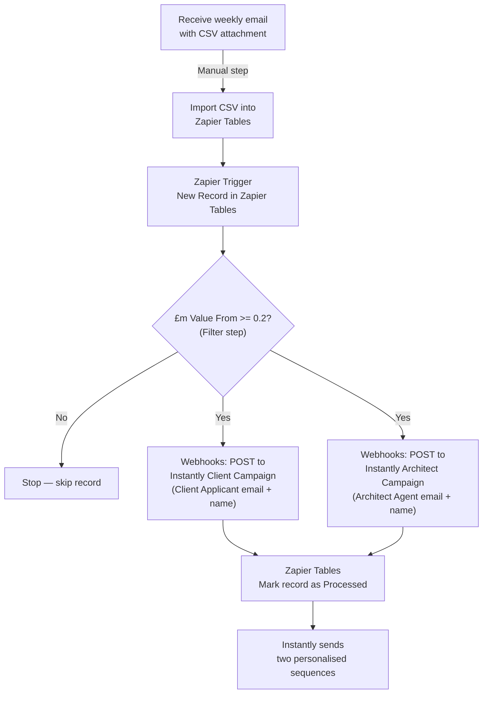

# Planning Applications → Instantly Automation (No AI / Lower Cost)

## Overview

Manually import the weekly planning applications CSV into Zapier Tables, which triggers a Zapier automation to filter by budget (£0.2m+), then push two leads per row into two separate Instantly campaigns — one for Client/Applicants and one for Architect/Agents. Personalisation uses static fields from the CSV directly (no OpenAI step).

---

## Architecture



---

## What You Need Before Starting

- **Zapier account** — Starter plan or above (multi-step zaps + Filter)
- **Instantly account** with API access
- **Instantly API key** — found in Instantly > Settings > API
- **Two Instantly campaigns** already created with email sequences using CSV field placeholders
- The weekly CSV file

---

## Zapier Tables Setup

Create one table named **"Planning Applications"**. Import the CSV as-is — all columns come through automatically. The key fields used by the automation are:

| CSV Column | Used for |
|---|---|
| `Heading` | Project title — used directly in email as `{{heading}}` |
| `£m Value From` | Budget filter (>= 0.2) |
| `£m Value To` | Budget range shown in email |
| `Proposal` | Full planning description — used directly in email |
| `Site Address` | Location — used directly in email |
| `Client Applicant Contact` | First name for Client email |
| `Client Applicant` | Company/developer name |
| `Mail Client Contact` | Email address → Client campaign |
| `Architect Agent Contact` | First name for Architect email |
| `Architect Agent` | Architect firm name |
| `Architect Agent Email` | Email address → Architect campaign |
| `Local Authority` | Used in email body |
| `Region` | Used in email body |
| `Project Stage` | Used in email body |

Add one extra column (leave blank on import):

| Column | Written by |
|---|---|
| `Processed` | Zapier — set to "Yes" when done |

**How you use it each week:**
1. Receive the planning email with the CSV attachment
2. In Zapier Tables → Import CSV — drag and drop the file
3. New records appear instantly and the zap triggers automatically for each row

---

## Zapier Steps (in order)

### Step 1 — Trigger: New Record in Zapier Tables

- Trigger app: **Zapier Tables**
- Event: **New Record**
- Select the "Planning Applications" table
- Fires immediately when a new record is created

### Step 2 — Filter: Budget Threshold

- App: **Filter by Zapier**
- Condition: `£m Value From` **Number — Greater than or equal to** `0.2`
- If not met, Zapier stops — no leads are created for this record

### Step 3a — Push to Instantly: Client Campaign

- App: **Webhooks by Zapier**
- URL: `https://api.instantly.ai/api/v1/lead/add`
- Method: POST
- Headers: `Content-Type: application/json`
- Add a **Filter** condition before this step: only run if `Mail Client Contact` is not empty
- Body:

```json
{
  "api_key": "YOUR_INSTANTLY_API_KEY",
  "campaign_id": "CLIENT_CAMPAIGN_ID",
  "skip_if_in_workspace": true,
  "leads": [
    {
      "email": "{{Mail Client Contact}}",
      "first_name": "{{Client Applicant Contact}}",
      "company_name": "{{Client Applicant}}",
      "custom_variables": {
        "heading": "{{Heading}}",
        "proposal": "{{Proposal}}",
        "site_address": "{{Site Address}}",
        "budget_from": "{{£m Value From}}",
        "budget_to": "{{£m Value To}}",
        "local_authority": "{{Local Authority}}",
        "project_stage": "{{Project Stage}}"
      }
    }
  ]
}
```

### Step 3b — Push to Instantly: Architect/Agent Campaign

- App: **Webhooks by Zapier**
- URL: `https://api.instantly.ai/api/v1/lead/add`
- Method: POST
- Add a **Filter** condition before this step: only run if `Architect Agent Email` is not empty
- Body:

```json
{
  "api_key": "YOUR_INSTANTLY_API_KEY",
  "campaign_id": "ARCHITECT_CAMPAIGN_ID",
  "skip_if_in_workspace": true,
  "leads": [
    {
      "email": "{{Architect Agent Email}}",
      "first_name": "{{Architect Agent Contact}}",
      "company_name": "{{Architect Agent}}",
      "custom_variables": {
        "heading": "{{Heading}}",
        "proposal": "{{Proposal}}",
        "site_address": "{{Site Address}}",
        "budget_from": "{{£m Value From}}",
        "budget_to": "{{£m Value To}}",
        "local_authority": "{{Local Authority}}",
        "project_stage": "{{Project Stage}}"
      }
    }
  ]
}
```

### Step 4 — Mark Record as Processed

- App: **Zapier Tables**
- Action: **Update Record**
- Record: the record ID from Step 1
- Set `Processed` to `Yes`

---

## Instantly Campaign Setup (do this first)

Create **two separate campaigns** in Instantly. Because there's no AI generating personalised copy, your email templates need to use the raw CSV fields as variables. Write templates that work naturally with these:

**Campaign 1 — Clients/Developers**
- Audience: property developers and applicants commissioning the build
- Email copy angle: Nomos Group as a construction delivery partner for their project
- Example subject: `Your project at {{site_address}}`
- Example opening: `I came across your {{heading}} application at {{site_address}} and wanted to reach out...`
- Body: reference `{{proposal}}`, `{{local_authority}}`, budget range `£{{budget_from}}m–£{{budget_to}}m`

**Campaign 2 — Architects/Agents**
- Audience: architects and planning agents
- Email copy angle: Nomos Group as a trusted contractor they can refer or recommend
- Example subject: `{{heading}} — {{local_authority}}`
- Example opening: `I noticed you're the agent on the {{heading}} application at {{site_address}}...`
- Body: reference `{{proposal}}`, `{{project_stage}}`

Note each campaign's **Campaign ID** from the URL — needed in Steps 3a and 3b.

---

## Cost Comparison

| | No AI (this plan) | With AI |
|---|---|---|
| Zapier plan needed | Starter (~£20/mo) | Professional (~£50/mo) |
| OpenAI cost | £0 | ~£0.001 per lead |
| Instantly | Same | Same |
| Personalisation quality | Uses raw CSV fields verbatim | AI-cleaned, natural language |

The main trade-off: the raw `Proposal` field contains planning jargon (e.g. "APPLICATION FOR PRIOR APPROVAL CHANGE OF USE IN RESPECT OF THE PROPOSED CONVERSION OF SECOND FLOOR OFFICES INTO 11 FLATS") which will appear as-is in the email. The AI version cleans this into plain English automatically.

---

## Key Notes

- **Zapier Starter plan** is sufficient for this version — no Looping or advanced features needed
- `skip_if_in_workspace: true` in Instantly prevents duplicate leads across weekly uploads
- Some rows have a client email but no architect email (and vice versa) — the empty-field filters in Steps 3a/3b handle this gracefully
- `£m Value From` uses decimal £m values (e.g. 0.5 = £500k) — ensure Zapier treats it as a Number field in the table
- CSV column names confirmed from "2026 Week 10.csv" — use them exactly as shown when mapping in Zapier

---

## Upgrade Path

Start with this plan to get the pipeline working. Once you're happy with the flow, adding the AI step is a single addition between the Filter and the webhook steps — it doesn't require rebuilding anything.
