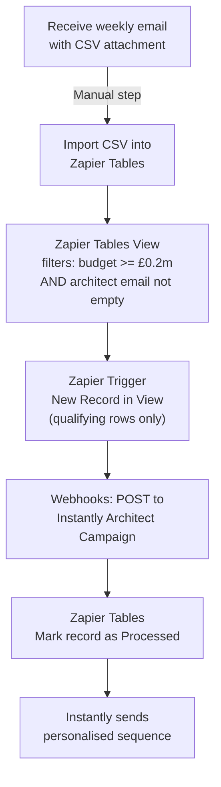

# Planning Applications → Instantly Automation (No AI / Lower Cost)

## Overview

Manually import the weekly planning applications CSV into Zapier Tables, which triggers a Zapier automation for qualifying rows only, then pushes each lead into a single Instantly campaign targeting Architects/Agents. The CSV does not include a client/applicant email address — only the architect/agent email is available, so outreach is architect-only. Personalisation uses static fields from the CSV directly (no OpenAI step).

> **Note:** The CSV includes `Architect Agent Email` only. There is no client/applicant email column. The client campaign has been removed from this plan.

---

## Architecture



---

## What You Need Before Starting

- **Zapier account** — Starter plan or above (multi-step zaps)
- **Instantly account** with API access
- **Instantly API key** — found in Instantly > Settings > API
- **One Instantly campaign** already created with an email sequence using CSV field placeholders (Architects/Agents only)
- The weekly CSV file

---

## Zapier Tables Setup

Create one table named **"Planning Applications"**. Import the CSV as-is — all columns come through automatically. The key fields used by the automation are:

| CSV Column | Used for |
|---|---|
| `Heading` | Project title — used directly in email as `{{heading}}` |
| `£m Value From` | Budget filter (>= 0.2) — set as Number field |
| `£m Value To` | Budget range shown in email |
| `Proposal` | Full planning description — used directly in email |
| `Site Address` | Location — used directly in email |
| `Architect Agent Contact` | First name for Architect email |
| `Architect Agent` | Architect firm name |
| `Architect Agent Email` | Email address → Architect campaign |
| `Local Authority` | Used in email body |
| `Region` | Used in email body |
| `Project Stage` | Used in email body |

The `Mail Client Contact` and `Client Applicant` columns are present in the CSV but **not used** — there is no client email to send to.

Add one extra column (leave blank on import):

| Column | Written by |
|---|---|
| `Processed` | Zapier — set to "Yes" when done |

**Important field type:** Set `£m Value From` and `£m Value To` to **Number** type in Zapier Tables. The view filter won't work correctly if they're treated as text.

---

## Zapier Tables View Setup

Create a filtered view to ensure Zapier only fires for qualifying rows — this prevents wasting tasks on rows that don't meet the criteria.

1. In the "Planning Applications" table, create a new **View**
2. Name it: `Qualifying Leads`
3. Add the following filters:
   - `£m Value From` — **greater than or equal to** — `0.2`
   - `Architect Agent Email` — **is different from** — *(leave value blank)*
4. Save the view

The second condition (is different from [blank]) effectively means "has a value" — it excludes any row where the architect email field is empty.

**Result:** Only rows with budget ≥ £200k AND an architect email present will appear in this view. Zapier triggers exclusively from this view.

---

## How you use it each week

1. Receive the planning email with the CSV attachment
2. In Zapier Tables → Import CSV — drag and drop the file
3. New records are created, the view filters them automatically, and the zap triggers only for qualifying rows

---

## Zapier Steps (in order)

### Step 1 — Trigger: New Record in View

- Trigger app: **Zapier Tables**
- Event: **New Record in View**
- Select the "Planning Applications" table
- Select the `Qualifying Leads` view
- Fires only for rows that pass both view filters

### Step 2 — Push to Instantly: Architect/Agent Campaign

- App: **Webhooks by Zapier**
- URL: `https://api.instantly.ai/api/v1/lead/add`
- Method: POST
- Headers: `Content-Type: application/json`
- Body:

```json
{
  "api_key": "YOUR_INSTANTLY_API_KEY",
  "campaign_id": "ARCHITECT_CAMPAIGN_ID",
  "skip_if_in_workspace": true,
  "leads": [
    {
      "email": "{{Architect Agent Email}}",
      "first_name": "{{Architect Agent Contact}}",
      "company_name": "{{Architect Agent}}",
      "custom_variables": {
        "heading": "{{Heading}}",
        "proposal": "{{Proposal}}",
        "site_address": "{{Site Address}}",
        "budget_from": "{{£m Value From}}",
        "budget_to": "{{£m Value To}}",
        "local_authority": "{{Local Authority}}",
        "project_stage": "{{Project Stage}}"
      }
    }
  ]
}
```

Replace `YOUR_INSTANTLY_API_KEY` and `ARCHITECT_CAMPAIGN_ID` with real values.

### Step 3 — Mark Record as Processed

- App: **Zapier Tables**
- Action: **Update Record**
- Record: the record ID from Step 1
- Set `Processed` to `Yes`

---

## Instantly Campaign Setup (do this first)

Create **one campaign** in Instantly targeting Architects/Agents. Because there's no AI generating personalised copy, your email template needs to use the raw CSV fields as variables. Write templates that work naturally with these:

**Campaign — Architects/Agents**
- Audience: architects and planning agents who submitted or are named on the application
- Email copy angle: Nomos Group as a trusted contractor they can refer or recommend
- Example subject: `{{heading}} — {{local_authority}}`
- Example opening: `I noticed you're the architect on the {{heading}} application at {{site_address}}...`
- Body: reference `{{proposal}}`, `{{project_stage}}`, budget range `£{{budget_from}}m–£{{budget_to}}m`

Note the **Campaign ID** from the URL — needed in Step 2.

---

## Reply Handling

Nomos and StoneRise are in the same Instantly workspace — separate workspaces aren't viable due to separate billing.

**Approach:** All reply notifications go to Matt via the workspace-level positive reply notification in Instantly (**Settings > Preferences > Positive reply notification**). Matt reviews all replies (StoneRise and Nomos) and manually forwards positive Nomos replies to Neo.

No additional automation needed for reply handling at this stage.

---

## Cost Comparison

| | No AI (this plan) | With AI |
|---|---|---|
| Zapier plan needed | Starter (~£20/mo) | Professional (~£50/mo) |
| Zapier tasks used | One per qualifying lead only | One per qualifying lead only |
| OpenAI cost | £0 | ~£0.001 per lead |
| Instantly | Same | Same |
| Personalisation quality | Uses raw CSV fields verbatim | AI-cleaned, natural language |

The main trade-off: the raw `Proposal` field contains planning jargon (e.g. "APPLICATION FOR PRIOR APPROVAL CHANGE OF USE IN RESPECT OF THE PROPOSED CONVERSION OF SECOND FLOOR OFFICES INTO 11 FLATS") which will appear as-is in the email. The AI version cleans this into plain English automatically.

---

## Key Notes

- **Zapier Starter plan** is sufficient for this version
- Filtering happens in the Zapier Tables **view** — Zapier only fires for qualifying rows, not every row in the table
- `skip_if_in_workspace: true` in Instantly prevents duplicate leads across weekly uploads
- The CSV does not include a client/applicant email — outreach is architect/agent only
- `£m Value From` uses decimal £m values (e.g. 0.5 = £500k) — must be set as a Number field in Zapier Tables
- CSV column names confirmed from "2026 Week 10.csv" — use them exactly as shown when mapping in Zapier

---

## Upgrade Path

Start with this plan to get the pipeline working. Once you're happy with the flow, adding an OpenAI step between the trigger and the webhook is a single addition — it generates a cleaned opening line, subject, and project summary. It doesn't require rebuilding anything.
