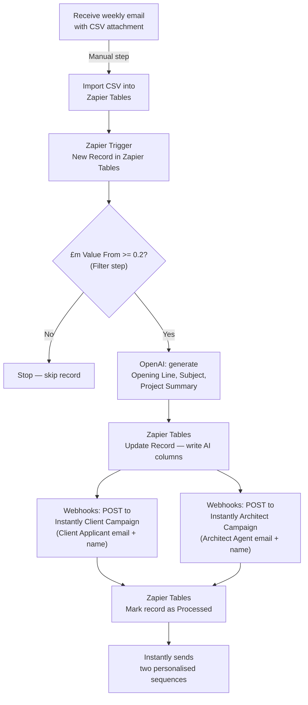

# Planning Applications → Instantly Automation

## Overview

Manually import the weekly planning applications CSV into Zapier Tables, which triggers a Zapier automation to filter by budget (£0.2m+), use OpenAI to generate personalised email content, then push two leads per row into two separate Instantly campaigns — one for Client/Applicants and one for Architect/Agents.

---

## Architecture



---

## What You Need Before Starting

- **Zapier account** — Professional plan or above (required for multi-step zaps, Filter, and Zapier Tables)
- **OpenAI API key** — platform.openai.com → API keys (paid, but very cheap — fractions of a penny per lead)
- **Instantly API key** — found in Instantly > Settings > API
- **Two Instantly campaigns** already created with email sequences and variable placeholders (`{{first_name}}`, `{{opening_line}}`, `{{project_summary}}`)
- The weekly CSV file (columns confirmed from "2026 Week 10.csv")

---

## Zapier Tables Setup

Create one table named **"Planning Applications"**. The CSV columns map directly — import them as-is. The key fields used by the automation are:

| CSV Column | Used for |
|---|---|
| `Heading` | Project title for AI prompt |
| `£m Value From` | Budget filter (>= 0.2) |
| `£m Value To` | Budget range for AI prompt |
| `Proposal` | Raw planning description fed to OpenAI |
| `Site Address` | Location for personalisation |
| `Client Applicant Contact` | First name for Client email |
| `Client Applicant` | Company/developer name |
| `Mail Client Contact` | Email address → Client campaign |
| `Architect Agent Contact` | First name for Architect email |
| `Architect Agent` | Architect firm name |
| `Architect Agent Email` | Email address → Architect campaign |
| `Local Authority` | Context for AI prompt |
| `Region` | Context for AI prompt |
| `Project Stage` | Context for AI prompt |
| `Project Category` | Context for AI prompt |

Add four extra columns at the end (leave blank on import — Zapier writes these):

| Column | Written by |
|---|---|
| `AI_Opening_Line` | OpenAI via Zapier |
| `AI_Subject` | OpenAI via Zapier |
| `AI_Summary` | OpenAI via Zapier |
| `Processed` | Zapier — set to "Yes" when done |

**How you use it each week:**
1. Receive the planning email with the CSV attachment
2. In Zapier Tables → Import CSV — drag and drop the file
3. New records appear instantly and the zap triggers automatically for each row

---

## Zapier Steps (in order)

### Step 1 — Trigger: New Record in Zapier Tables

- Trigger app: **Zapier Tables**
- Event: **New Record**
- Select the "Planning Applications" table
- Fires immediately when a new record is created

### Step 2 — Filter: Budget Threshold

- App: **Filter by Zapier**
- Condition: `£m Value From` **Number — Greater than or equal to** `0.2`
- If not met, Zapier stops — no leads are created for this record

### Step 3 — Generate Personalisation with OpenAI

- App: **OpenAI (ChatGPT)**
- Action: **Send Prompt**
- Model: `gpt-4o-mini`
- Prompt (replace bracketed items with the corresponding Zapier field mappings):

```
You are writing outbound sales email personalisation for Nomos Group, a construction services company.

Given the following planning application, generate three things:

Project Title: [Heading field]
Full Planning Description: [Proposal field]
Site Address: [Site Address field]
Estimated Budget: £[£m Value From field]m – £[£m Value To field]m
Project Category: [Project Category field]
Project Stage: [Project Stage field]
Local Authority: [Local Authority field]

Return ONLY a JSON object with exactly these three keys:
- "opening_line": A natural, specific one-sentence opening referencing the actual project and location (e.g. "I came across your application to convert second floor offices into 11 flats on Upper Green West, Mitcham...")
- "subject_line": A short, punchy subject line specific to this project — not generic
- "summary": A clean one-sentence plain-English summary of what the project involves

No preamble, no explanation — just the raw JSON.
```

- Output: a JSON string — parsed in the next step

### Step 3b — Parse the JSON Response

- App: **Formatter by Zapier**
- Action: **Utilities → Extract JSON**
- Input: the OpenAI response text
- Map out: `opening_line`, `subject_line`, `summary` as separate Zapier fields

### Step 4 — Write AI Content Back to Zapier Tables

- App: **Zapier Tables**
- Action: **Update Record**
- Record: the record ID from Step 1
- Set:
  - `AI_Opening_Line` → `opening_line` from Step 3b
  - `AI_Subject` → `subject_line` from Step 3b
  - `AI_Summary` → `summary` from Step 3b

### Step 5a — Push to Instantly: Client Campaign

- App: **Webhooks by Zapier**
- URL: `https://api.instantly.ai/api/v1/lead/add`
- Method: POST
- Headers: `Content-Type: application/json`
- Add a **Filter** condition before this step: only run if `Mail Client Contact` is not empty
- Body:

```json
{
  "api_key": "YOUR_INSTANTLY_API_KEY",
  "campaign_id": "CLIENT_CAMPAIGN_ID",
  "skip_if_in_workspace": true,
  "leads": [
    {
      "email": "{{Mail Client Contact}}",
      "first_name": "{{Client Applicant Contact}}",
      "company_name": "{{Client Applicant}}",
      "custom_variables": {
        "opening_line": "{{AI_Opening_Line}}",
        "project_summary": "{{AI_Summary}}",
        "subject_line": "{{AI_Subject}}",
        "site_address": "{{Site Address}}",
        "local_authority": "{{Local Authority}}"
      }
    }
  ]
}
```

### Step 5b — Push to Instantly: Architect/Agent Campaign

- App: **Webhooks by Zapier**
- URL: `https://api.instantly.ai/api/v1/lead/add`
- Method: POST
- Add a **Filter** condition before this step: only run if `Architect Agent Email` is not empty
- Body:

```json
{
  "api_key": "YOUR_INSTANTLY_API_KEY",
  "campaign_id": "ARCHITECT_CAMPAIGN_ID",
  "skip_if_in_workspace": true,
  "leads": [
    {
      "email": "{{Architect Agent Email}}",
      "first_name": "{{Architect Agent Contact}}",
      "company_name": "{{Architect Agent}}",
      "custom_variables": {
        "opening_line": "{{AI_Opening_Line}}",
        "project_summary": "{{AI_Summary}}",
        "subject_line": "{{AI_Subject}}",
        "site_address": "{{Site Address}}",
        "local_authority": "{{Local Authority}}"
      }
    }
  ]
}
```

### Step 6 — Mark Record as Processed

- App: **Zapier Tables**
- Action: **Update Record**
- Record: the record ID from Step 1
- Set `Processed` to `Yes`

---

## Instantly Campaign Setup (do this first)

Create **two separate campaigns** in Instantly:

**Campaign 1 — Clients/Developers**
- Audience: property developers and applicants commissioning the build
- Email copy angle: Nomos Group as a construction delivery partner for their project
- Subject line: `{{subject_line}}`
- Opening: `{{opening_line}}`
- Body: reference `{{project_summary}}`, `{{site_address}}`

**Campaign 2 — Architects/Agents**
- Audience: architects and planning agents who regularly work on projects
- Email copy angle: Nomos Group as a trusted contractor they can refer or recommend
- Subject line: `{{subject_line}}`
- Opening: `{{opening_line}}`
- Body: reference `{{project_summary}}`, `{{local_authority}}`

Note each campaign's **Campaign ID** from the URL — needed in Steps 5a and 5b.

---

## Segmentation (future enhancement)

Once running, add a **Paths by Zapier** step after the filter to route leads to different sub-campaigns based on:
- `Project Category` — e.g. "HOUSING UNITS" vs "MIXED USE DEVELOPMENT" vs "COMMERCIAL"
- `Region` — e.g. London vs outside London

---

## Key Notes

- **Zapier Professional plan** required — covers multi-step zaps, Filter, and Zapier Tables
- No Google account needed — everything stays inside Zapier
- Zapier Tables triggers fire immediately on new records (no polling delay)
- `skip_if_in_workspace: true` in Instantly prevents duplicate leads across weekly uploads
- Some rows have a client email but no architect email (and vice versa) — the empty-field filters in Steps 5a/5b handle this gracefully
- `£m Value From` uses decimal £m values (e.g. 0.5 = £500k) — ensure Zapier treats it as a Number field in the table
- CSV column names are confirmed from "2026 Week 10.csv" — use them exactly as shown when mapping in Zapier
