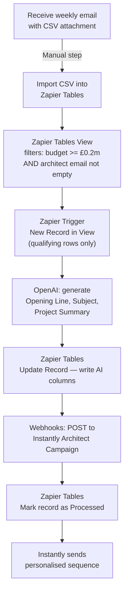

# Planning Applications → Instantly Automation (With AI Personalisation)

## Overview

Manually import the weekly planning applications CSV into Zapier Tables, which triggers a Zapier automation for qualifying rows only. OpenAI generates a personalised opening line, subject, and project summary per lead, then pushes each lead into a single Instantly campaign targeting Architects/Agents. The CSV does not include a client/applicant email address — only the architect/agent email is available, so outreach is architect-only.

> **Note:** The CSV includes `Architect Agent Email` only. There is no client/applicant email column. The client campaign has been removed from this plan.

---

## Architecture



---

## What You Need Before Starting

- **Zapier account** — Professional plan or above (required for multi-step zaps and Zapier Tables)
- **OpenAI API key** — platform.openai.com → API keys (paid, but very cheap — fractions of a penny per lead)
- **Instantly API key** — found in Instantly > Settings > API
- **One Instantly campaign** already created with an email sequence and variable placeholders (`{{first_name}}`, `{{opening_line}}`, `{{project_summary}}`) — Architects/Agents only
- The weekly CSV file (columns confirmed from "2026 Week 10.csv")

---

## Zapier Tables Setup

Create one table named **"Planning Applications"**. Import the CSV as-is — all columns come through automatically. The key fields used by the automation are:

| CSV Column | Used for |
|---|---|
| `Heading` | Project title for AI prompt |
| `£m Value From` | Budget filter (>= 0.2) — set as Number field |
| `£m Value To` | Budget range for AI prompt |
| `Proposal` | Raw planning description fed to OpenAI |
| `Site Address` | Location for personalisation |
| `Architect Agent Contact` | First name for Architect email |
| `Architect Agent` | Architect firm name |
| `Architect Agent Email` | Email address → Architect campaign |
| `Local Authority` | Context for AI prompt |
| `Region` | Context for AI prompt |
| `Project Stage` | Context for AI prompt |
| `Project Category` | Context for AI prompt |

The `Mail Client Contact` and `Client Applicant` columns are present in the CSV but **not used** — there is no client email to send to.

Add four extra columns at the end (leave blank on import — Zapier writes these):

| Column | Written by |
|---|---|
| `AI_Opening_Line` | OpenAI via Zapier |
| `AI_Subject` | OpenAI via Zapier |
| `AI_Summary` | OpenAI via Zapier |
| `Processed` | Zapier — set to "Yes" when done |

**Important field type:** Set `£m Value From` and `£m Value To` to **Number** type in Zapier Tables. The view filter won't work correctly if they're treated as text.

---

## Zapier Tables View Setup

Create a filtered view to ensure Zapier only fires for qualifying rows — this prevents wasting tasks on rows that don't meet the criteria.

1. In the "Planning Applications" table, create a new **View**
2. Name it: `Qualifying Leads`
3. Add the following filters:
   - `£m Value From` — **greater than or equal to** — `0.2`
   - `Architect Agent Email` — **is different from** — *(leave value blank)*
4. Save the view

The second condition (is different from [blank]) effectively means "has a value" — it excludes any row where the architect email field is empty.

**Result:** Only rows with budget ≥ £200k AND an architect email present will appear in this view. Zapier triggers exclusively from this view.

---

## How you use it each week

1. Receive the planning email with the CSV attachment
2. In Zapier Tables → Import CSV — drag and drop the file
3. New records are created, the view filters them automatically, and the zap triggers only for qualifying rows

---

## Zapier Steps (in order)

### Step 1 — Trigger: New Record in View

- Trigger app: **Zapier Tables**
- Event: **New Record in View**
- Select the "Planning Applications" table
- Select the `Qualifying Leads` view
- Fires only for rows that pass both view filters

### Step 2 — Generate Personalisation with OpenAI

- App: **OpenAI (ChatGPT)**
- Action: **Send Prompt**
- Model: `gpt-4o-mini`
- Prompt (map the bracketed items to the corresponding Zapier fields from Step 1):

```
You are writing outbound sales email personalisation for Nomos Group, a construction services company.

Given the following planning application, generate three things:

Project Title: [Heading field]
Full Planning Description: [Proposal field]
Site Address: [Site Address field]
Estimated Budget: £[£m Value From field]m – £[£m Value To field]m
Project Category: [Project Category field]
Project Stage: [Project Stage field]
Local Authority: [Local Authority field]

Return ONLY a JSON object with exactly these three keys:
- "opening_line": A natural, specific one-sentence opening referencing the actual project and location (e.g. "I came across your application to convert second floor offices into 11 flats on Upper Green West, Mitcham...")
- "subject_line": A short, punchy subject line specific to this project — not generic
- "summary": A clean one-sentence plain-English summary of what the project involves

No preamble, no explanation — just the raw JSON.
```

- Output: a JSON string — parsed in the next step

### Step 2b — Parse the JSON Response

- App: **Formatter by Zapier**
- Action: **Utilities → Extract JSON**
- Input: the OpenAI response text
- Map out: `opening_line`, `subject_line`, `summary` as separate Zapier fields

### Step 3 — Write AI Content Back to Zapier Tables

- App: **Zapier Tables**
- Action: **Update Record**
- Record: the record ID from Step 1
- Set:
  - `AI_Opening_Line` → `opening_line` from Step 2b
  - `AI_Subject` → `subject_line` from Step 2b
  - `AI_Summary` → `summary` from Step 2b

### Step 4 — Push to Instantly: Architect/Agent Campaign

- App: **Webhooks by Zapier**
- URL: `https://api.instantly.ai/api/v1/lead/add`
- Method: POST
- Headers: `Content-Type: application/json`
- Body:

```json
{
  "api_key": "YOUR_INSTANTLY_API_KEY",
  "campaign_id": "ARCHITECT_CAMPAIGN_ID",
  "skip_if_in_workspace": true,
  "leads": [
    {
      "email": "{{Architect Agent Email}}",
      "first_name": "{{Architect Agent Contact}}",
      "company_name": "{{Architect Agent}}",
      "custom_variables": {
        "opening_line": "{{AI_Opening_Line}}",
        "project_summary": "{{AI_Summary}}",
        "subject_line": "{{AI_Subject}}",
        "site_address": "{{Site Address}}",
        "local_authority": "{{Local Authority}}"
      }
    }
  ]
}
```

Replace `YOUR_INSTANTLY_API_KEY` and `ARCHITECT_CAMPAIGN_ID` with real values.

### Step 5 — Mark Record as Processed

- App: **Zapier Tables**
- Action: **Update Record**
- Record: the record ID from Step 1
- Set `Processed` to `Yes`

---

## Instantly Campaign Setup (do this first)

Create **one campaign** in Instantly targeting Architects/Agents:

**Campaign — Architects/Agents**
- Audience: architects and planning agents who submitted or are named on the application
- Email copy angle: Nomos Group as a trusted contractor they can refer or recommend
- Subject line: `{{subject_line}}`
- Opening: `{{opening_line}}`
- Body: reference `{{project_summary}}`, `{{local_authority}}`

Note the **Campaign ID** from the URL — needed in Step 4.

---

## Reply Handling

Nomos and StoneRise are in the same Instantly workspace — separate workspaces aren't viable due to separate billing.

**Approach:** All reply notifications go to Matt via the workspace-level positive reply notification in Instantly (**Settings > Preferences > Positive reply notification**). Matt reviews all replies (StoneRise and Nomos) and manually forwards positive Nomos replies to Neo.

No additional automation needed for reply handling at this stage.

---

## Segmentation (future enhancement)

Once running, add a **Paths by Zapier** step after the trigger to route leads to different sub-campaigns based on:
- `Project Category` — e.g. "HOUSING UNITS" vs "MIXED USE DEVELOPMENT" vs "COMMERCIAL"
- `Region` — e.g. London vs outside London

---

## Key Notes

- **Zapier Professional plan** required — covers multi-step zaps and Zapier Tables
- Filtering happens in the Zapier Tables **view** — Zapier only fires for qualifying rows, not every row in the table
- `skip_if_in_workspace: true` in Instantly prevents duplicate leads across weekly uploads
- The CSV does not include a client/applicant email — outreach is architect/agent only
- `£m Value From` uses decimal £m values (e.g. 0.5 = £500k) — must be set as a Number field in Zapier Tables
- CSV column names are confirmed from "2026 Week 10.csv" — use them exactly as shown when mapping in Zapier
